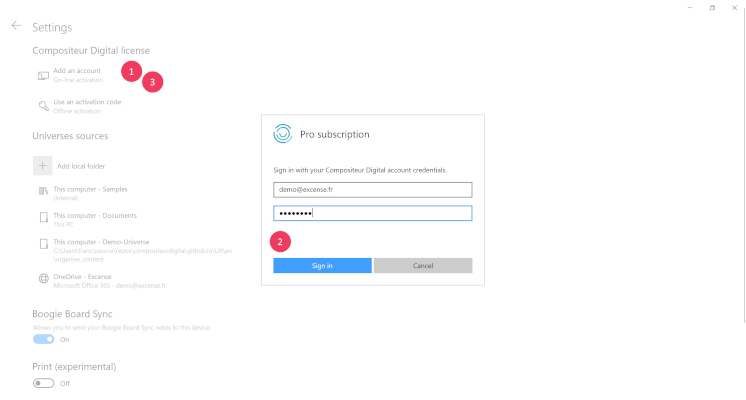

# Compositeur Digital UX account

The Compositeur Digital UX offers a preview mode a with a limited set of features without account creation. 

To unlock this limitation, use your existing Compositeur Digital account or create one [here](http://www.compositeurdigital.com/Account/Register)

Please follow the description below to sign in from the application 

## Sign-in methods 

### From a laptop

1. On the app start page, click on `Sign in`.
1. Enter your username and password.
1. You're done !

To sign out :  

1. On the app start page, click on your name
2. Click on `Sign out`.

### From a shared device (e.g. Microsoft Surface Hub)

1. On the app start page, click on the `...` at the bottom right corner of the page.
1. Click on the `Settings` button.
1. On the settings page, click on `Sign in`.
1. Enter your username and password.
1. You're done ! 

**Note** : The device will store your credentials. The Compositeur Digital UX will use the last signed-in account anytime you start a new session 

To sign out : 

1. On the app start page, click on the `...` at the bottom right corner of the page.
1. Click on the `Settings` button.
1. On the settings page, click on `Sign out`.

[Back to Administrative Guide](index.md)
