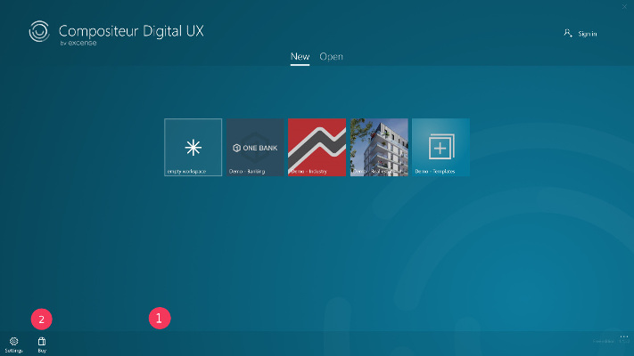

# Administrative Guide

Follow this guide to learn how you can manage your Compositeur Digital UX administrative data : account, licenses, Compositeur Digital folders...

## Summary

* [Use your Compositeur Digital UX account](#use-your-compositeur-digital-ux-account)
  * [Enter your credentials](#enter-your-credentials)
* [Purchase a Compositeur Digital UX license](#purchase-a-compositeur-digital-ux-license)
  * [In-app purchase](#in-app-purchase)
* [Add existing Compositeur Digital folders](#add-existing-compositeur-digital-folders)

## Use your Compositeur Digital UX account

The Compositeur Digital UX offers a preview mode a with a limited set of features without account creation. 

If you have an existing Compositeur Digital account please follow the description below to sign in from the application 

Alternatively you can create an account [here](http://www.compositeurdigital.com/Account/Register) and contact us or purchase a license

### Enter your credentials

1. On the app start page, click on the `...` at the bottom right corner of the page.
2. Click on the `Settings` button.

3. On the settings page, click on `Add license`, under `Compositeur Digital license`.
4. Enter your username and password.
5. Click on `Sign in`
6. You're connected! Your name appears under `Compositeur Digital license`. 

Once you are back on the app start page, your license information appears at the bottom right corner. 

**Note** : The device will remember you, and when you'll start a new session on your device, Compositeur Digital UX will use your account.

At any time, you can freely decide to sign out.

1. On the app start page, click on the `...` at the bottom right corner of the page.
1. Click on the `Settings` button.
1. On the settings page, click on your name under `Compositeur Digital license`, then click on `Sign out`.

## Purchase a Compositeur Digital UX license

### In-app purchase

Compositeur Digital UX offers in-app purchase. If you decide to purchase the product, all the restrictions which come with the free version will be removed and you'll use an unlimited version of Compositeur Digital UX. 

1. On the app start page, click the `...` button at the bottom right corner of the page.
1. Click on the `Buy` button.
1. Follow the buying instructions.
1. Your purchase has been authorized, congratulations!

## Add existing Compositeur Digital folders

By default, your universes are all stored under a single folder of your personal computer. This folder is `Documents\Compositeur Digital UX`.

Depending on your enterprise configuration, you could have an access to a shared storage system (e.g. Microsoft SharePoint, Google Drive, Dropbox, ect). You can add these folders as Compositeur Digital folders. It means that when you start Compositeur Digital UX, the system will check if there are universes in all the folders you have set.

Using a shared storage system is very convenient to share your universes with all the people who need to use Compositeur Digital UX.

To add existing Compositeur Digital folders:

1. In the Universe page open the "Settings" menu.
1. Tap on `Add existing Compositeur Digital folders`
1. Pick your folder.
1. That's all &#x1F604;

[Back to Documentation](../index.md)
