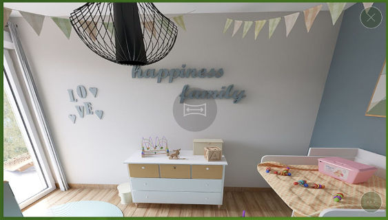
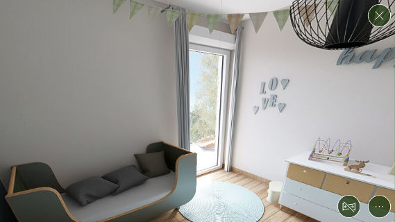
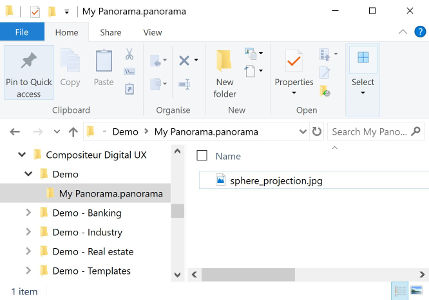
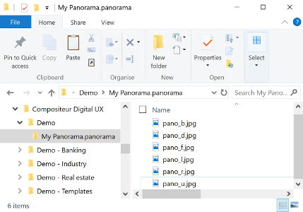

# Panorama : 360° view - first person

This content type allows you to display a 360° view of a scene (e.g. landscapes, interior views...) using specific images.

To interact with a Panorama, press the navigation button at the center of the item : it starts the navigation mode.

In navigation mode, slide your finder on the item to rotate the camera and see all the scene. If you don't touch the panorama for 10 seconds in navigation mode, it will automatically disable the navigation mode and your item will behave normally when you touch it.
You can also press the `end navigation` button (next to the action button) to end navigation.

## Action within Compositeur Digital UX

Panorama items support the following action. To have a complete overview of each action, [see the section Actions](actions.md)

**Actions menu**

| Annotate | Capture  | Duplicate | Save as  | Selection | Share    | 
|:--------:|:--------:|:---------:|:--------:|:---------:|:--------:|
| &#x2716; | &#x2714; | &#x2714;  | &#x2716; | &#x2714;  | &#x2716; |

**Interaction with the item**

| Navigation Mode |
|:---------------:|
| &#x2714;        |

## Content extension

To use a panorama, put the images to render in a folder, and add the extension `.panorama` at the end of the name of your folder.
Inside your panorama, only use files that end with `.jpeg`, `.jpg`, `.png`.

## Create a panorama

1. In your environment folder, create a folder named `<Name of your panorama>.panorama` (e.g. `My Panorama.panorama`).
1. Drag and drop all the files which are composing your panorama in this folder.
1. (Optional) Add an image (`.jpg` or `.png`) named `_preview` to change the preview.

### Projection types

Two types of projection are supported.

### Spherical projection

Place a single image with the spherical projection of the scene in the folder. The name of the file does not matter, just keep in mind that this file cannot be named `_background` or `_preview`.

**Important** : Do not place any other images in this folder (except one `_preview` file, if you want to change the preview).

### Cube projection

Place 6 images, corresponding to the six faces of your cube in the folder. Keep in mind that none of the files should be named `_background` or `_preview`.

> Note : The default preview displayed, if a `_preview` file is not placed in the folder, will be the front face of the cube.

**Naming** : your files should respect the following conventions:
   * *up* : named "u" or matches "\_u\_", "\_u", "u\_", "up" (e.g. `u.jpg`, `pano_u.jpg`, `up.jpg`)
   * *down* : named "d" or matches "\_d\_", "\_d", "d\_", "down" (e.g. `d.jpg`, `pano_d.jpg`, `down.jpg`)
   * *front* : named "f" or matches "\_f\_", "\_f", "f\_", "front" (e.g. `f.jpg`, `pano_f.jpg`, `front.jpg`)
   * *back* : named "b" or matches "\_b\_", "\_b", "b\_", "back" (e.g. `b.jpg`, `pano_b.jpg`, `back.jpg`)
   * *left* : named "l" or matches "\_l\_", "\_l", "l\_", "left" (e.g. `l.jpg`, `pano_left.jpg`, `left.jpg`)
   * *right* : named "r" or matches "\_r\_", "\_r", "r\_", "right" (e.g. `r.jpg`, `pano_r.jpg`, `right.jpg`)

**Important** : Do not place any other images in this folder (except one `_preview` file).

Next : [Quizz (Compositeur Digital UX format)](quiz.md)

[Back to Supported Content](index.md)

