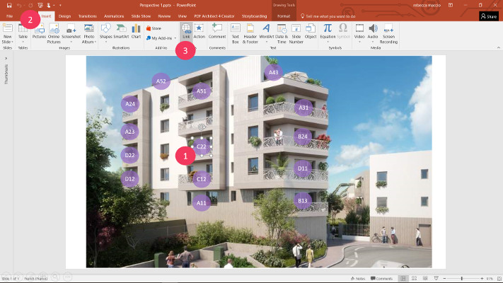

# Powerpoint

## Summary
* [Description](#description)
* [File extensions](#file-extensions)
* [Actions within Compositeur Digital UX](#actions-within-compositeur-digital-ux)
* [Hot spots](#hot-spots)
* [Slideshow](#slideshow)

## Description

Powerpoints are supported natively by Compositeur Digital UX.

## File extensions

Format supported are `.ppt` and `.pptx`.

## Actions within Compositeur Digital UX

Powerpoints support the following action. To have a complete overview of each action, [see the section Actions](actions.md)

**Actions menu**

| Annotate | Capture  | Duplicate | Open in native app | Save as  | Selection | Share    | Slides   |
|:--------:|:--------:|:---------:|:------------------:|:--------:|:---------:|:--------:|:--------:|
| &#x2714; | &#x2714; | &#x2714;  | &#x2714;           | &#x2714; | &#x2714;  | &#x2714; | &#x2714; | 

**Interaction with the item**

| Captures mode | Hyperlinks | Hot Spots | Next     | Previous | 
|:-------------:|:----------:|:---------:|:--------:|:--------:|
| &#x2714;      | &#x2714;   | &#x2714;  | &#x2714; | &#x2714; |

## Hot Spots

You can create a "hot spot" on a document to open another document when touched. This interaction is created using Microsoft Powerpoint editor.

1. Create a transparent shape on top of the selected hot spot area. The shape should cover entire hot spot area.

**Warning 1 : If the area is the text box. Select the text BOX. Do not not select the TEXT**

**Warning 2 : The color of the shape must be TRANSPARENT. If you are creating a shape that is not filled by any color, the link will not work.** 

2. Select the shape, and go to INSERT 
3. Go to HyperLink and define the location of the target document.

> Note 1 : The target document must be somewhere in your universe folder. You can use the `.content` folder feature if you do not wish to display the target folder in your universe.

> Note 2: You can also right-click on the shape and go to the HyperLink menu
	
4. Save your Powerpoint presentation at the desired location in your universe folder.

## Slideshow

By default, powerpoint files are handled by Compositeur Digital UX like `.slideshow` extension. [See Slideshow section](slideshows.md).

Next [Video files](video.md)

[Back to Supported Content](index.md)
