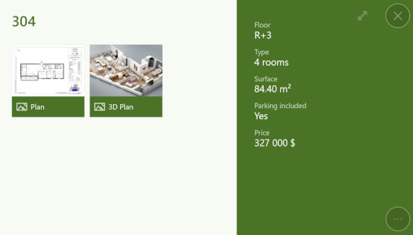
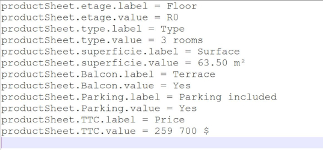

# Product Sheet

## Summary
* [Description](#description)
* [Actions within Compositeur Digital UX](#actions-within-compositeur-digital-ux)
* [Metadata available](#metadata-available)

## Description

A product sheet allows you to visualize information about an item. It is typically used in combination with a [search interface](search.md). From a product sheet, you can link documents or folder. 

## Actions within Compositeur Digital UX

Prodjct sheet items support the following action. To have a complete overview of each action, [see the section Actions](actions.md)

**Actions menu**

| Annotate | Capture  | Duplicate | Open in native app | Save as  | Selection | Share    |
|:--------:|:--------:|:---------:|:------------------:|:--------:|:---------:|:--------:|
| &#x2716; | &#x2716; | &#x2714;  | &#x2714;           | &#x2714; | &#x2714;  | &#x2714; |

**Interaction with the item**

| Launch items |
|:------------:|
| &#x2714;     | 

## Context extension

To use a product sheet, add the extension `.productsheet` at the end of name of your folder.

## Create a product sheet

1. In your universe folder, create a folder named `<Name of your product sheet>.productsheet` (e.g. `304.productsheet`).
1. Put all the documents you want to link to this product sheet inside your folder. 
1. To add informations which will be displayed in the product sheet, create a file `_meta.txt`. Fill this file with two lines per information. It should be: 
`key.label = <The label to display>`  
`key.value = <the value associated to this label>`

## Download a sample

A Demo Universe which contains various product sheets is available, [give it a try!](../Demo-Universe.zip) &#x1f604;

Next : [Sequences : Pre-rendered 360° view (orbital, Compositeur Digital UX format)](sequences.md)

[Back to Supported Content](index.md)
