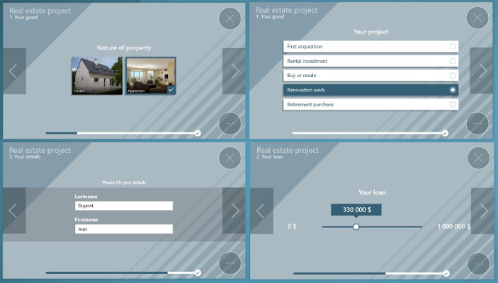
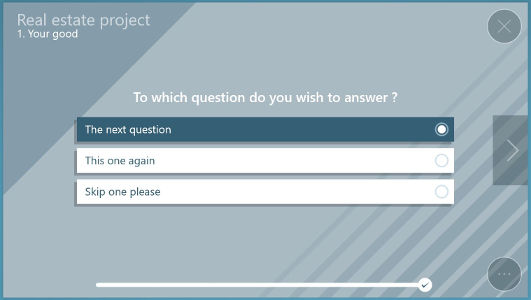
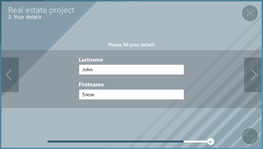
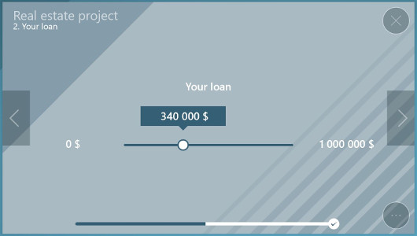
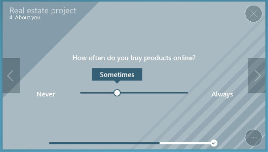
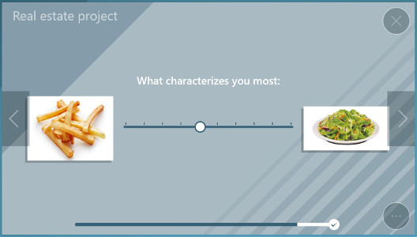
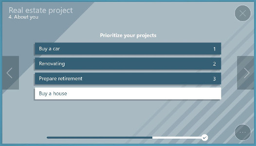
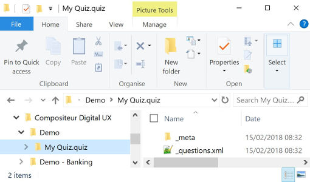

# Quiz

This type of content allows you to display interactive Quiz, that will help you understanding your user needs.



## Summary 
* [Actions within Compositeur Digital UX](#actions-within-compositeur-digital-ux)
* [Content extension](#content-extension)
* [Questions : questions.xml](#questions--_questionsxml)
	* [Sections](#sections)
	* [Pages](#pages)
	* [Page Order](#page-order)
	* [Page Types](#page-types)
   		* [Question Page](#questionpage)
   		* [Page](#page)
		* [Info Page](#infopage)
		* [Numeric Slider Page](#numericsliderpage)
		* [Label Slider Page](#labelsliderpage)
		* [Image Slider Page](#imagesliderpage)
		* [Document Page](#documentpage)
		* [Order Page](#orderpage)
* [Create a quiz](#create-a-quiz)
* [Download a sample](#download-a-sample)
   

## Actions within Compositeur Digital UX

Quizzes support the following action. To have a complete overview of each action, [see the section Actions](actions.md)

**Actions menu**

| Annotate | Capture  | Duplicate | Save as  | Selection | Share    |
|:--------:|:--------:|:---------:|:--------:|:---------:|:--------:|
| &#x2716; | &#x2716; | &#x2714;  | &#x2714; | &#x2714;  | &#x2714; |

**Interaction with the item**

| Launch items | Next     | Previous | Questions |
|:------------:|:--------:|:--------:|:---------:|
| &#x2714;     | &#x2714; | &#x2714; | &#x2714;  |

## Content extension

To use a quiz, put all the items you need in a folder, and add the extension `.quiz` at the end of the name of your folder.

Inside your folder, provide a file called `_questions.xml`, and a folder called `_meta` which will contain all the images used inside the quiz.

### <a name="questions"></a>Questions : `_questions.xml`

The quiz file must contains two parts:  `sections` and `pages`.
Generic file structure:
```xml
<quizz>
    <sections>
        list of sections
    </sections>ˋ
    <pages>
        list of pages
    </pages>
</quizz>
```

Each pages will describe a question. Sections will let you group pages that have the same section name. 

#### Sections
Set the section display name in a `section` tag and optionnaly define the `id` attribute if you need to create a
reference to this section.

```xml
<section id="intro">1. INTRODUCTION</section>
```

#### Pages
You can create a quiz with different page types but all pages should have the following items in common:
 - a `sectionId` attribute that assigns a page to a section. The section name will appear on top of the page.
 - an optional `id` attribute to be used as an identifier if a reference to that page is needed. 
 - a `nextPageId` attribute: optional reference to the page that shoud be displayed next. If not set, the following page described in the file will be used. 

#### Page order 
The first page described in the list will always be the first page displayed.
The last page described will be by default the last page displayed,
To force a page to finish the quiz, set the `nextPageId` attribute value to `@end`.

#### Page types
##### `questionPage`
This type lets you create a question with multiple answers. Please note that an answer must be selected before going to the next page.

Here are the attributes for `questionPage`:

| Keys            | Description                                                                                        |
|:----------------|:---------------------------------------------------------------------------------------------------|
| `allowMultiple` | Set to `true` to allow the selection of multiple answers.					       | 
| `id`            | The id of the question.                                                                            |
| `label`         | Question text to display. Supersedes the `visual` attribute.    				       |
| `sectionId`     | Defines the section id to which the question belongs.                                              |
| `sideVisual`    | Allows you to display an image besides your questions. The image must exist in the `_meta` folder. |
| `visual`        | Name of the question image file (without extension). The file must exist in the `_meta` folder.    |

The content of the `questionPage` is the list of answers, which can be of various types:
 - texted answers, with the tag `answer`:
 ```xml
 <answer>my answer</answer>
 ```
 - visual answers, with the tag `imageAnswer`. Set the `visual` attribute to the name of the targeted image (without extension) in the `_meta` folder:
   ```xml
   <imageAnswer visual="image 2"/>
   ```
   optionally you can set a caption:
   ```xml
   <imageAnswer visual="image 2">my caption</imageAnswer>
   ```
It is not possible to mix text answers with visual answers in the same question.

You can define conditional questions based on answers provided by the user. To do so, use the `nextPageId` attribute to jump to a specific page for a given answer : 

```xml
<questionPage id="Q1" sectionId="section 2" label="To which question do you wish to answer ?" >
	<answer>The next question</answer>
	<answer nextPageId="Q1">This one again</answer>
	<answer nextPageId="Q3">Skip one please</answer>
</questionPage>

<questionPage id="Q2" sectionId="section 3" label="The next question">
	...
</questionPage>	
	
<questionPage id="Q3" sectionId="section 3" label="The last question">
	...
</questionPage>
```


##### `page`
Describes a simple page to display with either text or image:

| Keys            | Description                                                                                        |
|:----------------|:---------------------------------------------------------------------------------------------------|
| `id`            | The id of the question.                                                                            |
| `label`         | Question text to display. Supersedes the `visual` attribute.	    			       |
| `sectionId`     | Defines the section id to which the question belongs.                                              |
| `visual`        | Name of the question image file (without extension). The file must exist in the `_meta` folder.    |	 

```xml
<page sectionId="intro" label="This is a test"/>
```

##### `infoPage`
Displays a simple form in which the user can type in texted answers. 

| Keys            | Description                                                                                        |
|:----------------|:---------------------------------------------------------------------------------------------------|
| `id`            | The id of the question.                                                                            |
| `label`         | Title of the information page.  			                                               | 
| `sectionId`     | Defines the section id to which the question belongs.                                              |
| `valueKey`      | Link this value to a value shared at your project level. See page [Shared values](../advanced_setting.md#shared-values).

Set the `label` attribute of the `info` tags to define a name for the text box.

```xml
<infoPage sectionId="intro" label="Please fill out your identity">
	<info label="Name"/>
	<info label="Surname"/>
</infoPage>
```



##### `numericSliderPage`
Displays a page with a single slider that lets the user choose a (rounded) numerical value:

| Keys            | Description                                                                                        |
|:----------------|:---------------------------------------------------------------------------------------------------|
| `default`       | (Optional) Preselected value.                                                                      |
| `format`        | Changes the way the value is displayed.                                                            |
| `id`            | The id of the question.                                                                            |
| `label`         | Question text to display.                                    	    			       |
| `max`           | Maximum selectable value.                                                                          |
| `maxLabel`      | (Optional) Specific display value for the maximum value.                                           |  
| `min`           | Minimum selectable value.                                                                          |
| `minLabel`      | (Optional) Specific display value for the minimum value.                                           | 
| `sectionId`     | Defines the section id to which the question belongs.                                              |
| `stepSize`      | Difference between two steps of the cursor.							       |
| `valueKey`      | Link this value to a value shared at your project level. See page [Shared values](../advanced_setting.md#shared-values). The only numeric value wich can be shared is `finance.budget`. It defines the current mortgage loan. |

Some possible `format`:
 - `N0`: rounded value
 - `C0`: rounded monetary value according to the current regional setting (i.e. uses €, £, $, etc. where relevant)

```xml
<numericSliderPage id="funds" sectionId="section 3" label="Your available funds" min="0" max="5000000" stepSize="5000" format="C0" valueKey="finance.budget" />
```


##### `labelSliderPage`
This displays a page with a slider with predefined values.

| Keys            | Description                                                                                        |
|:----------------|:---------------------------------------------------------------------------------------------------|
| `id`            | The id of the question.                                                                            |
| `label`         | Question text to display.  			                                                       | 
| `sectionId`     | Defines the section id to which the question belongs.                                              |

Add `answer` tags to add predefined values, the fisrt being the minimum and the last being the maximum.

example :
```xml
<labelSliderPage sectionId="section1" label="Faites vous souvent des achats en ligne ?">
	<answer>Jamais</answer>
	<answer>Parfois</answer>
	<answer>Souvent</answer>
	<answer>Toujours</answer>
</labelSliderPage>
```



##### `imageSliderPage`
This type offers the same functionality as the previous `labelSliderPage` but using images for predefined values.

| Keys            | Description                                                                                        |
|:----------------|:---------------------------------------------------------------------------------------------------|
| `id`            | The id of the question.                                                                            |
| `label`         | Title of the page.  			                                               | 
| `leftVisual`    | Picture to the left of the cursor.                                                                 |
| `rightVisual`   | Picture to the right of the cursor.                                                                |
| `sectionId`     | Defines the section id to which the question belongs.                                              |
| `stepQuantity`  | The number of selectable steps (recommended value : 10).                                           |
| `visual`        | Name of the question image file (without extension). The file must exist in the `_meta` folder.    |

```xml
<imageSliderPage sectionId="part 1" label="What characterizes you most:" leftVisual="image1" rightVisual="image2" stepQuantity="10"/>
```


##### `documentPage`
Displays a link to open a document in the Compositeur Digital.

| Keys            | Description                                                                                        |
|:----------------|:---------------------------------------------------------------------------------------------------|
| `document`      | Name of the document to open, which must be available in the same folder as the quiz.              |
| `id`            | The id of the question.                                                                            |
| `label`         | Title of the page.  			                                             	       | 
| `sectionId`     | Defines the section id to which the question belongs.                                              |

```xml
<documentPage text="Loan simulator" nextPageId="@end" document="Loan simulator"/>
```

##### `orderPage`
Displays a lists of values to be ordered by the user.

| Keys            | Description                                                                                        |
|:----------------|:---------------------------------------------------------------------------------------------------|
| `answerNumber`  | Minimum number of answers to select.           						       |
| `id`            | The id of the question.                                                                            |
| `label`         | Question text to display.  			                                             	       | 
| `sectionId`     | Defines the section id to which the question belongs.                                              |
| `sideVisual`    | Allows you to display an image besides your questions. The image must exist in the `_meta` folder. |

Add a list of `answer` or `imageAnswer` for available choices. The two types cannot be mixed.

```xml
<orderPage sectionId="section 1" label="Prioritize your projects" answerNumber="3">
    <answer>Renovating</answer>
    <answer>Buy a house</answer>
    <answer nextPageId="tousLesBiens">Buy a car</answer>
    <answer nextPageId="tousLesBiens">Prepare retirement</answer>
</orderPage>
```

```xml
<orderPage sectionId="section 1" label="I would rather live in a" answerNumber="2">
    <visualAnswer visual="house" visualChecked="test1">House</visualAnswer>
    <visualAnswer visual="flat" visualChecked="test2">Flat</visualAnswer>
  </orderPage>
```



## Create a quiz

1. In your environment folder, create a folder named `<Name of your sequence>.quiz` (e.g. `My quiz.quiz`).
1. In this folder, add a file named `_questions.xml`.
1. (Optional) If you need graphical resources for your quiz, create a folder named `_meta`.
1. (Optional)Put all the images you need in this folder.
1. (Optional) If you want to link documents from your quiz, put these documents inside the `.quiz` folder.
1. (Optional) If you want to add a preview to your quiz, add a file named `_preview.jpg` or `_preview.png` in your folder. 

**Note** : By default, a quiz does not have a preview. Don't forget to create one if you need one.



## Download a sample

A Demo Universe which contains a sample for a quiz is available, [give it a try!](../Demo-Universe.zip) &#x1f604;

Next : [Search Interface (Compositeur Digital UX format)](search.md)

[Back to Supported Content](index.md)

