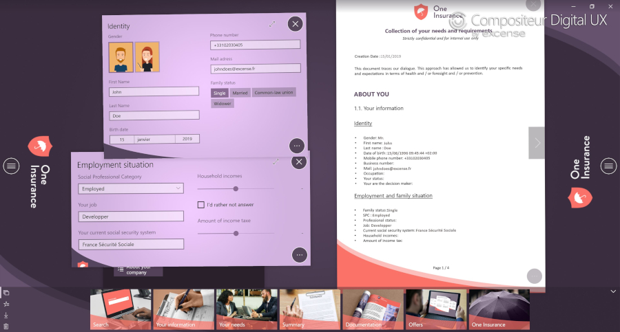
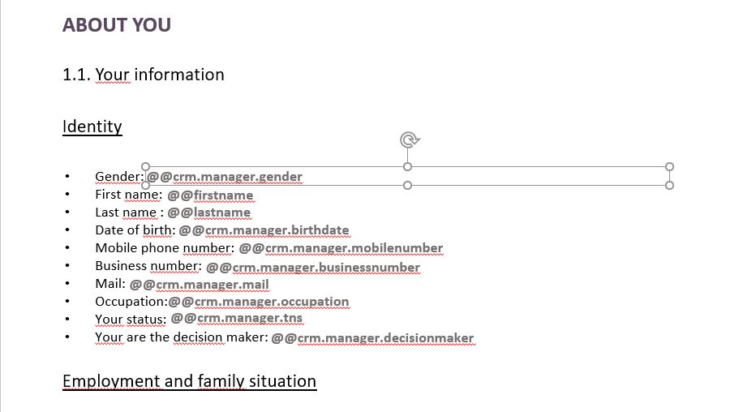
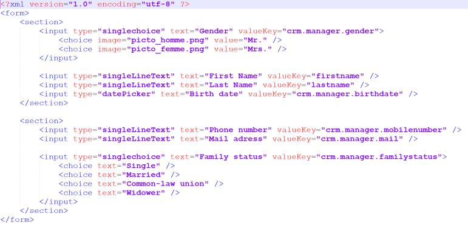

# Report

## Summary
* [Description](#description)
* [Actions within Compositeur Digital UX](#actions-within-compositeur-digital-ux)
* [Content extension](#content-extension)
* [Create a report](#create-a-report)
* [Special tags](#special-tags)
* [Download a sample](#download-a-sample)

## Description

Reports are used to summarize all the information collected through [forms](form.md) and [quiz](quiz.md). 

## Actions within Compositeur Digital UX

Reports support the following action. To have a complete overview of each action, [see the section Actions](actions.md)

**Actions menu**

| Annotate | Capture  | Duplicate | Save as  | Selection | Share    | Slides   |
|:--------:|:--------:|:---------:|:--------:|:---------:|:--------:|:--------:|
| &#x2714; | &#x2714; | &#x2714;  | &#x2714; | &#x2714;  | &#x2714; | &#x2714; | 

**Interaction with the item**

| Captures mode | Hyperlinks | Hot Spots | Next     | Previous | 
|:-------------:|:----------:|:---------:|:--------:|:--------:|
| &#x2714;      | &#x2714;   | &#x2714;  | &#x2714; | &#x2714; |

## Content extension

A report is placed in a folder called `<name of your report>.report`. In this folder, there is a file named `Template.pptx`. This file contains the design of your report.

## Create a report

Create a folder that ends with `.report`. In this folder, create a file named `Template.pptx`. This file contains individual text fields which start with `@@`. 

The text which is after the double `@@` indicates the name of a key. This key should exist in a [form](form.md) or a [quiz](quiz.md).

Finally, when the [forms](form.md) are edited through Compositeur Digital UX, the report is updated with the information provided.

## Special tags

| Tag name | Description |
|:--------:|:------------|
| @@@creationdate | Filled automatically with the current date. |

## Download a sample

A Demo Universe which contains a report is available, [give it a try!](../Demo-Universe.zip) &#x1f604;

Next : [Creating templates](templates.md)

[Back to Supported Content](index.md)
