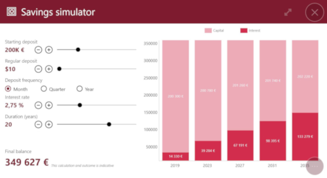
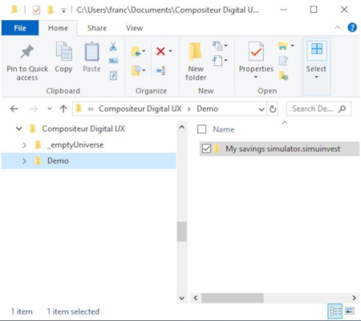

# Savings Simulator

## Summary
* [Description](#description)
* [Actions within Compositeur Digital UX](#actions-within-compositeur-digital-ux)
* [Content extension](#content-extension)
* [Create a savings simulator](#create-a-savings-simulator)
* [Metadata available](#metadata-available)
* [Download a sample](#download-a-sample)

## Description

This content type allows you to display an interactive savings simulator with editable parameters.

## Actions within Compositeur Digital UX

Savings simulator supports the following action. To have a complete overview of each action, [see the section Actions](actions.md)

**Actions menu**

| Annotate | Capture  | Duplicate | Open in native app | Save as  | Selection | Share    |
|:--------:|:--------:|:---------:|:------------------:|:--------:|:---------:|:--------:|
| &#x2716; | &#x2714; | &#x2714;  | &#x2714;           | &#x2714; | &#x2714;  | &#x2714; |

## Content extension

To use a savings simulator, add the extension `.simuinvest` at the end of the name of your folder.

## Create a savings simulator

1. In your environment folder, create a folder named `<Name of your savings simulator>.simuinvest` (e.g. `My simulator.simuinvest`).
1. (Optional) You can change the preview of the savings simulator. In your `.simuinvest` folder, put an image (`.jpg` or `.png`) named `_preview`. If you don't provide a `_preview`, the item will have a default preview (shown below).

 

## Metadata available

| Metadata Key                                 | Type     | Default            | Description |
|:-------------------------------------------- |:---------|:-------------------|:-|
| `simulator.depositFrequencyDefault`          | `text`   | `Month`            | sets the default value of the deposit frequency. It could be `Month`, `Quarter` or `Year` |
| `simulator.interestRateMinValue`             | `number` | 0                  | sets the min value for the interest rate |
| `simulator.interestRateMaxValue`             | `number` | 10                 | sets the max value for the interest rate |
| `simulator.interestRateDefaultValue`         | `number` | 2.75               | sets the default value for the interest rate |
| `simulator.regularDepositMinValue`           | `number` | 10                 | sets the minimum deposit value |
| `simulator.regularDepositMaxValue`           | `number` | 20000              | sets the maximum deposit value |
| `simulator.regularDepositTickFrequency`      | `number` | 100                | sets the interval between two values for a deposit |
| `simulator.savingsTermMinValue`              | `number` | 0                  | sets the shortest duration of a saving plan |
| `simulator.savingsTermMaxValue`              | `number` | 30                 | sets the longest duration of a saving plan |
| `simulator.savingsTermDefaultValue`          | `number` | 20                 | sets the default duration of a saving plan |
| `simulator.savingsTermTickFrequency`         | `number` | 1                  | sets the interval between two values for a saving plan duration |
| `simulator.startingDepositMinValue`          | `number` | 0                  | sets the min value for the starting deposit amount |
| `simulator.startingDepositMaxValue`          | `number` | 800000             | sets the max value for the starting deposit amount |
| `simulator.startingDepositTickFrequency`     | `number` | 5000               | sets the interval between two values for a starting deposit amount |

## Download a sample

A Demo Universe which contains samples for a savings simulator is available, [give it a try!](../Demo-Universe.zip) &#x1f604;

Next : [Calculator](calculator.md)

[Back to Supported Content](index.md)
