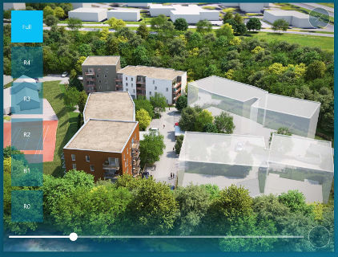
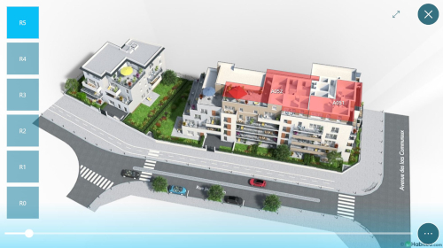
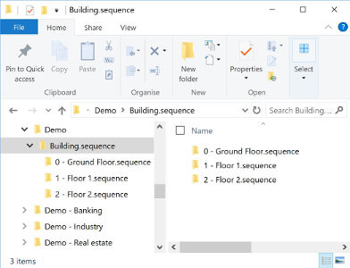
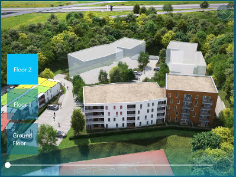

# Sequences : 360° view

## Summary
* [Description](#description)
* [Actions within Compositeur Digital UX](#actions-within-compositeur-digital-ux)
* [Content extension](#content-extension)
* [Create a sequence](#create-a-sequence)
* [Layers](#layers)
* [Hot spot](#hot-spots)
* [Download a sample](#download-a-sample)

## Description

This content type allows you to display a 360° view of any objects, using a sequence of pre-rendered images (e.g. buildings).

Sequences also support hot spots : you can define area on each slides of your sequence to create interactive hot spots. When hot spots are touched, they will open the content they are linked to. In the picture below, hot spots appear in red.

## Actions within Compositeur Digital UX

Sequences support the following action. To have a complete overview of each action, [see the section Actions](actions.md)

**Actions menu**

| Annotate | Capture  | Duplicate | Save as  | Selection | Share    |
|:--------:|:--------:|:---------:|:--------:|:---------:|:--------:|
| &#x2716; | &#x2714; | &#x2714;  | &#x2716; | &#x2714;  | &#x2716; |

**Interaction with the item**

| Layers   | Move     | Hot spots |
|:--------:|:--------:|:----------|
| &#x2714; | &#x2714; | &#x2714;  |

## Content extension

To use a sequence, put all the images which are composing your sequence in a folder, and add the extension `.sequence` at the end of the name of your folder. Inside your sequence, only use files that end with `.jpeg`, `.jpg` or `.png`.

## Create a sequence

1. In your universe folder, create a folder named `<Name of your sequence>.sequence` (e.g. `My sequence.sequence`).
2. Drag and drop all the files which are composing your sequence in this folder.
3. (Optional) If you want to display several layers, add one folder for each layer inside your `.sequence` folder. Then put all the images you need for each layer inside their folder. The folder representing a layer can end with `.sequence` or not.

## Layers

If you have multiple layers to display (the different floors of a building for example), you can organize your images folders for each layer, and put them in a global .sequence folder.

Here is an example :

* Building.sequence
  * Ground Floor
    * 001.png
    * 002.png
  * Floor 1
    * 001.png
    * 002.png
...

Layers will be ordered by their names, from bottom to top, i.e. :

...
* Floor 1
* Ground Floor

 

## Hot spots

A sample containing hot spots definitions for sequences is available in the section below.

## Download a sample

A Demo Universe which contains a sample for a sequence is available, [give it a try!](../Demo-Universe.zip) &#x1f604;

Next : [Mortgage Simulator (Compositeur Digital UX format)](simulator.md)

[Back to Supported Content](index.md)
