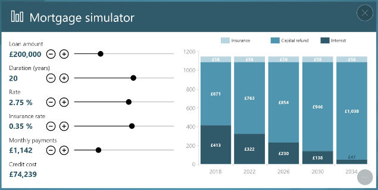
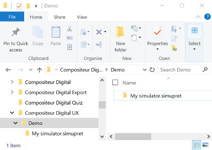

# Mortgage Simulator

This content type allows you to display an interactive mortgage simulator with editable parameters.

## Actions within Compositeur Digital UX

Mortgage simulator supports the following action. To have a complete overview of each action, [see the section Actions](actions.md)

**Actions menu**

| Annotate | Capture  | Duplicate | Save as  | Selection | Share    |
|:--------:|:--------:|:---------:|:--------:|:---------:|:--------:|
| &#x2716; | &#x2714; | &#x2714;  | &#x2714; | &#x2714;  | &#x2714; |

## Content extension

To use a mortgage simulator, add the extension `.simupret` at the end of the name of your folder.

## Create a mortgage simulator

1. In your environment folder, create a folder named `<Name of your mortgage simulator>.simupret` (e.g. `My simulator.simupret`).
1. (Optional) You can change the preview of the mortgage simulator. In your `.simupret` folder, put an image (`.jpg` or `.png`) named `_preview`. If you don't provide a `_preview`, the item will have a default preview (shown below).

 

## Download a sample

A Demo Universe which contains samples for a mortgage simulator is available, [give it a try!](../Demo-Universe.zip) &#x1f604;

Next : [Slideshows (Compositeur Digital UX format)](slideshows.md)

[Back to Supported Content](index.md)
