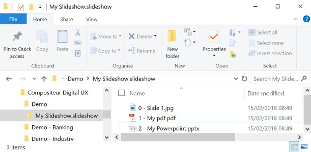

# Slideshows

## Summary
* [Description](#description)
* [Actions within Compositeur Digital UX](#actions-within-compositeur-digital-ux)
* [Content extension](#content-extension)
* [Create a slideshow](#create-a-slideshow)
* [Download a sample](#download-a-sample)

## Description

Slideshows are useful to concatenate various files such as images, pdfs or powerpoints to a single document.

 

## Actions within Compositeur Digital UX

Slideshows support the following action. To have a complete overview of each action, [see the section Actions](actions.md)

**Actions menu**

| Annotate | Capture  | Duplicate | Open in native app | Save as  | Selection | Share    | Slides   |
|:--------:|:--------:|:---------:|:------------------:|:--------:|:---------:|:--------:|:--------:|
| &#x2714; | &#x2714; | &#x2714;  | &#x2714;           | &#x2714; | &#x2714;  | &#x2714; | &#x2714; | 

**Interaction with the item**

| Captures mode | Hyperlinks | Hot Spots | Next     | Previous | 
|:-------------:|:----------:|:---------:|:--------:|:--------:|
| &#x2714;      | &#x2714;   | &#x2714;  | &#x2714; | &#x2714; |

## Content extension 

To use a slideshow, put all the files you want in a folder, and add the extension `.slideshow` at the end of the name of your folder.
Only use images, PowerPoint presentations and PDF documents, or `.pptx`, or another `.slideshow` folder.

## Create a slideshow

1. In your environment folder, create a folder named `<Name of your slideshow>.slideshow` (e.g. `My slideshow.slideshow`).
2. Drag and drop all the PDF documents,  PowerPoint presentations and images you need.

> Note 1 : To make sure slides in your slideshow are ordered, you can number them from 0 to X. Numbers won't be displayed in Compositeur Digital UX (e.g. `0 - First level` will be `First level`).

> Note 2 : By default, the preview of the item will be the first file composing the slideshow. You can provide your own preview with a file named `_preview.jpg` or `_preview.png`.

**Important** : If your slideshow includes a powerpoint, and if this powerpoint has [Hot Spots](powerpoint.md#hot-spots), make sure the content linked from the powerpoint of your slideshow belongs to your slideshow directoty. Keep in mind that content can be put in a hidden folder, which will not appear in Compositeur Digital UX.

## Download a sample

A Demo Universe which contains a sample for a slideshow is available, [give it a try!](../Demo-Universe.zip) &#x1f604;

Next : [Web Pages](web_page.md)

[Back to Supported Content](index.md)
