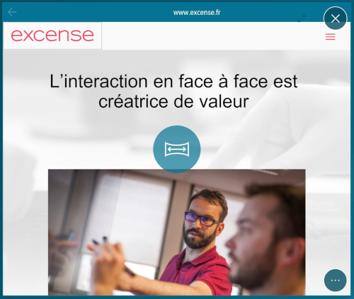
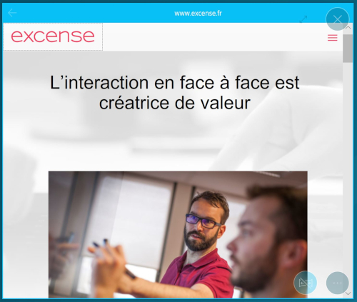
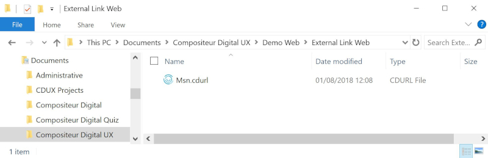
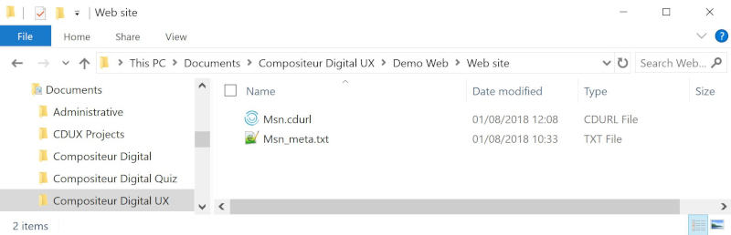
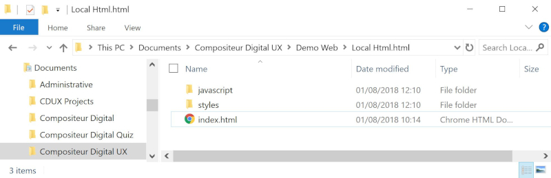
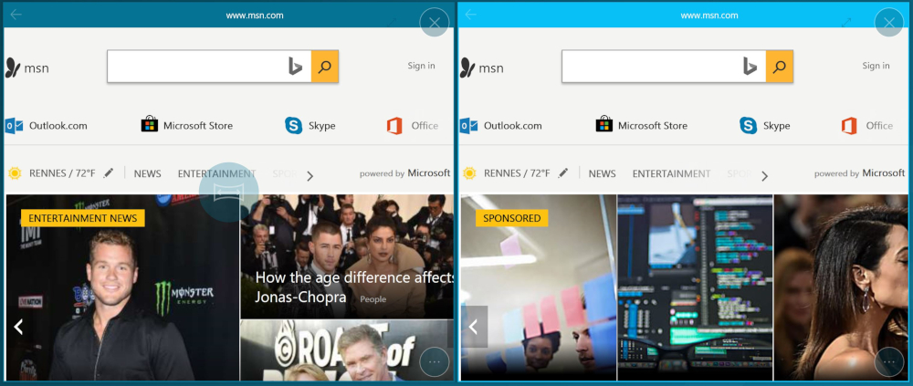
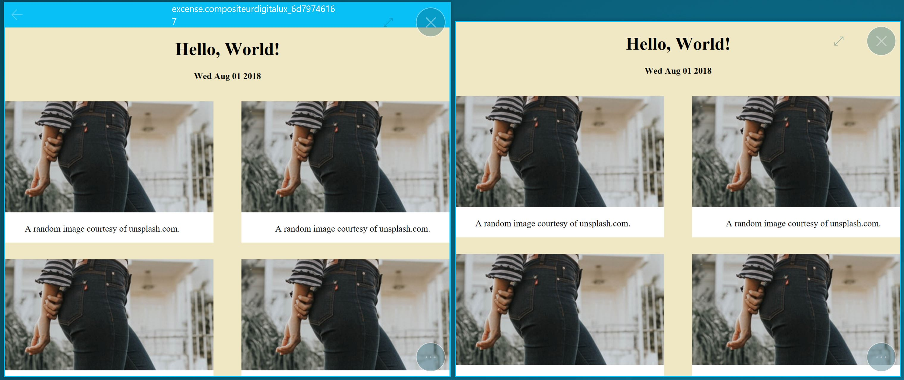

# Web Pages

## Summary
* [Actions within Compositeur Digital UX](#actions-within-compositeur-digital-ux)
* [Content extensions](#content-extensions)
  * [I want to display a web site link which will be opened in a web browser](#i-want-to-display-a-web-site-link-which-will-be-opened-in-a-web-browser)
  * [I want to display an external web site inside my Compositeur Digital UX](#i-want-to-display-an-external-web-site-inside-my-compositeur-digital-ux)
  * [I want to display local HTML content](#i-want-to-display-local-html-content)
* [Interactions with Compositeur Digital UX](#interactions-with-compositeur-digital-ux)
* [Summup](#summup)
* [Metadata available](#metadata-available)
* [Download a sample](#download-a-sample)

## Description

This content allows you to display a local html content, or a web site page inside your Compositeur Digital UX. Web site pages can also be displayed as links, so that when they are selected, an external web browser is showing them.

To interact with a web page, press the navigation button at the center of the item: This will trigger the navigation mode.

In navigation mode, you can interact with the content displayed in webview in the same manner as you would do on a web browser. However, the manipulation actions (move, zoom, rotate) you can ordinary use on all documents are disabled (unless you touch the document on its top bar, where the website name is written). Press the `end navigation` button (next to the action button) to end navigation.

## Actions within Compositeur Digital UX

Web page items support the following action. To have a complete overview of each action, [see the section Actions](actions.md)

**Actions menu**

| Annotate | Capture  | Duplicate |Open in native app | Save as  | Selection | Share    | 
|:--------:|:--------:|:---------:|:-----------------:|:--------:|:---------:|:--------:|
| &#x2716; | &#x2716; | &#x2714;  | &#x2716;          | &#x2716; | &#x2714;  | &#x2716; |

**Interaction with the item**

| Navigation Mode | Web page navigation |
|:---------------:|:--------------------|
| &#x2714;        | &#x2714;            |

## Content extensions

Depending on your goal, you have several content extensions which can be used.

### I want to display a web site link which will be opened in a web browser

To display a web site link which will be opened in a web browser, create a file named `<NameOfMySite>.cdurl`. Inside this file, add a line :
`url = <UrlOfMyWebsite>`,  e.g, `url = https://www.msn.com/en-us/`

### I want to display an external web site inside my Compositeur Digital UX

To display a web site inside your Compositeur Digital UX, you need a `.cdurl` file, and a `meta` file. Metadata are very useful to customize the way your Compositeur Digital UX acts. [Check the metadata section for more information](../advanced_setting.md).

Create a file named `<NameOfYourCdurlFile>_meta.txt`,  e.g., i have a `.cdurl` file named `msn.cdurl`, my meta file should be named `msn_meta.txt`.

Inside this meta file, add a line : `table.viewer = cdux`.
With this line, the web page will be opened inside your Compositeur Digital UX.

### I want to display local HTML content

To display local HTML content, create a folder and add the extension `.html` or `.web` at the end of the name of your folder. Inside your `web` folder, you can use `css`, `htm`, `html` and `js` files. You can use images as well.

If you have several `html` files inside this folder, by default, Compositeur Digital UX will look for a file named `index.hmtl`. If no such file can be found, the starting file will be the first regarding the alphabetical order.

### Interactions with Compositeur Digital UX

With html contents, you can have interaction between your webpage an Compositeur Digital UX using javascript.
All actions are available through the object `CDUX`.

openItem: open an item from your universe by giving its relative path from your webview
 `<a href="javascript:CDUX.openItem('../image.jpg');">open image</a>`
 `<a href="javascript:CDUX.openItem('2ndPage.html?name=test');">open new webview</a>`

getProjectData: retrieve a value stored on the current project by giving its key
 `var budget = CDUX.getProjectData("firstName");`

setProjectData: sets a value on the current project for a given key
 `CDUX.setProjectData("finance.budget", 600000);`

getInstanceData: retrieve a value stored on the current page instance by giving its key
 `var value = CDUX.getInstanceData("questionnay.thirdAnswer");`

setInstanceData: sets a value on the current page for a given key
 `CDUX.setInstanceData("questionnay.thirdAnswer", "Yes");`

ProjectData are shared with all other documents whereas instanceData only concerns the current instance of your document (Note that InstanceData will be copied in case you duplicate the webview).
With ProjectData you can interact with with the values of an other webview, but also of a [Quiz](quiz.md) or a [Mortgage simulator](simulator.md)

### Summup

|          | Web site link (web browser) | Web site (CDUX)   | Local Html content       |
|----------|:----------------------------|:------------------|:-------------------------|
|Extensions| `cdurl`                     | `cdurl` + `_meta` | Folder `.html` or `.web` |

## Metadata available

Metadata will help you to customize the way your web viewer behaves.

| Metadata Key                      | Value               | Description                                                               |
|:---------------------------------:|:-------------------:|:--------------------------------------------------------------------------|
| `table.viewer`                    | cdux                | Makes sure the `cdurl` link will be displayed inside Compositeur Digital UX |
| `web.manipulationMode`            | `toggle` or `integrated`              | If `toggle`, all touch movements acts only on the container until the user enable navigation mode, then all interactions are transmited to the web content. If `integrated`, single taps are transmited to web content whereas more complex touch movements (slide, zoom, ...) will move the container  |
| `web.showChrome`                  | True of False       | If true, a navigation bar at the top of the view will be shown. Else, no navigation bar will be displayed. |
| `web.viewport.width`              | 1000 (number)       | Sets the default width of the view.                                       |
| `web.viewport.height`             | 800 (number)        | Sets the default height of the view.                                      |

By default , `cdurl` link have the metadata `web.manipulationMode` set to 1 and the metadata `web.showChrome` set to True.

Folders with the extension `.web` or `html` have the metadata `web.manipulationMode` set to 0 and the metadata `web.showChrome` set to False.

Navigation Mode to 1 (left) and 0 (right)

ShowChrome True (left) and ShowChrome False (right)

## Download a sample

A Demo Universe which contains samples for web page contents is available, [give it a try!](../Demo-Universe.zip) &#x1f604;

Next : [Forms](form.md)

[Back to Supported Content](index.md)
