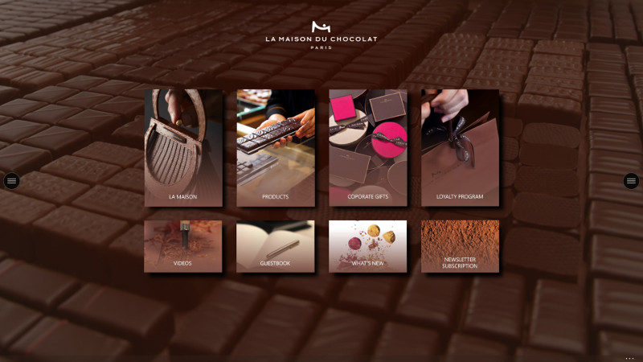
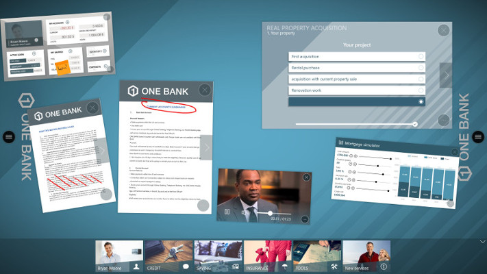
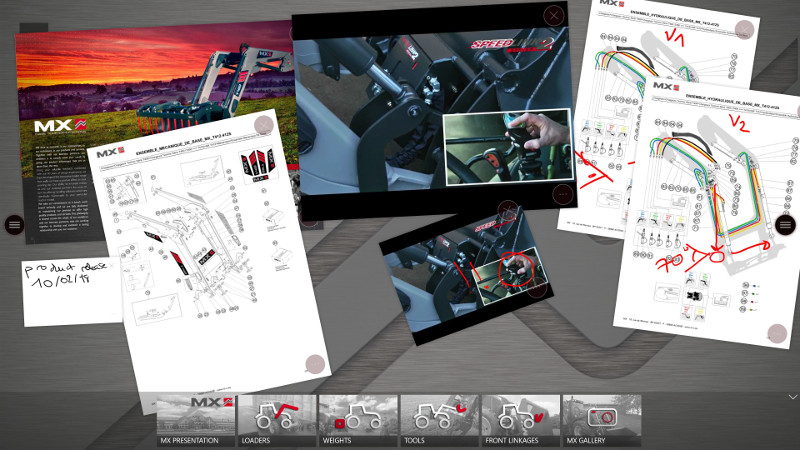
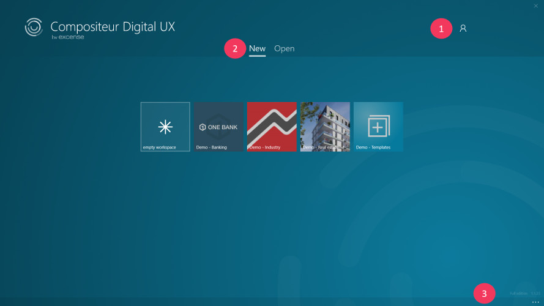
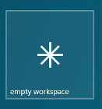
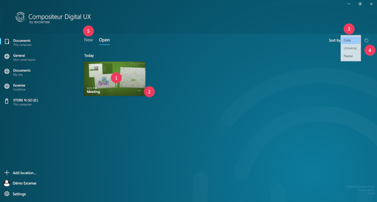
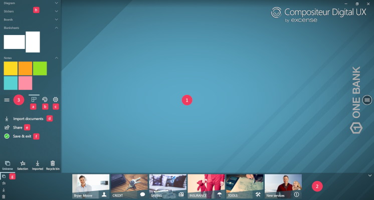
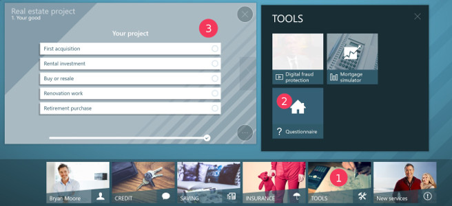

# Presentation 

Compositeur Digital UX is a unique solution to enhance professional presentations in face to face meetings. 
Leverage all your existing files (PDF, PowerPoint, images, videos) to achieve high value added sales or boost collaboration.

Compositeur Digital UX allows you to 
* Create links between your documents to deliver structured presentation and create an immersive story telling
* Bring live annotations to any document
* Add sticky notes on your important documents
* Live-import any document you need during your presentation
* Collaborate and bring your team’s ideas to life

Take your face-to-face presentations to the next level and unleash the power of interaction with your audience!

## Summary
* [Vocabulary](#vocabulary)
* [Overview](#overview)
  * [Samples](#samples)
  * [Universes](#universes)
  * [Projects](#projects)
  * [Workspace](#workspace)
    * [Open a document](#open-a-document)
    * [Manipulate a document](#manipulate-a-document)
    * [Close a document](#close-a-document)

## Vocabulary 

* **Universe** : a universe is a windows folder which contains a set of documents, images, video, 3D models which will be used during your working session. During your work through the workspace, changes to these files can be saved in different projects.
* **Projects** : a project contains all the work you have achieved in a universe : annotations, documents opened and manipulated, ect. Each project is attached to a universe.
* **Workspace** : the workspace allows you to open, visualize and manipulate various types of documents : images, pdf, powerpoints, video, ect... Using pencil, you can write annotations on your documents.

## Overview

### Samples

Universe with interactive background, perfect for self-service devices!

Banking context, face-to-face meeting.

Industry, product review meeting.

### Universes

The Compositeur Digital UX start page presents all the universes available. 

1. Depending on your device type, on the top left corner you can connect to your Compositeur Digital account ([see section Compositeur Digital UX account](../administrative_guide/account.md)).
1. A tab displays all the universes available. 
1. At the bottom of the page, a navigation bar offers you to access the settings of the application, and if you don't own a full version of Compositeur Digital UX, to buy one.

If you don't have any universes when starting Compositeur Digital UX, a pop up will ask you to install the Demo Content. 

You can also start an empty workspace by clicking on:

### Projects

Clicking on "Open" drives you to the projects you have been working on. All the projects that you have saved will appear here.

1. These projects can be sorted by creation date, last access date, name, or universes' names.
2. Clicking on "New" drives you to your universes page.

### Workspace

Once you have decided which project or universe you want to work on, tapping on the project/universe icon will launch the workspace.
The workspace is divided into 3 areas:

1. The workspace : a collaborative area, to display, manipulate and edit content.
1. A dock to browse and access your content.
1. The menu button, available on the right side and left side of the screen, useful to : 
   a. Add notes, blanksheets or templates.
   b. Change the ink color of your pen.
   c. Access settings of your project.
   d. Import / paste new documents
   e. Share your work
   f. Save your project
   g. Visualize all your documents : favorites, imported documents, history, environment.

#### Open a document

1. On the dock, tap on the folder to open it.
1. In the folder view, tap on any document to display it.
1. Your item is now displayed on the workspace.

#### Manipulate a document

Compositeur Digital UX has been designed to be used with tactile interactions and gestures.
The following gestures are supported:
1. Move.
1. Pinch / Spread to zoom in /out.
1. Rotation

#### Close a document

A document can be closed by tapping on the cross at the top right corner.

You can also close a document by throwing it away on the edges of your screen. If you apply enough strength, the document will be removed from the workspace. 

**Important** : a document that you have closed is never lost. You can retrieve it from "History".

Next : [Workflow](workflow.md)

[Back to User Guide](index.md)
