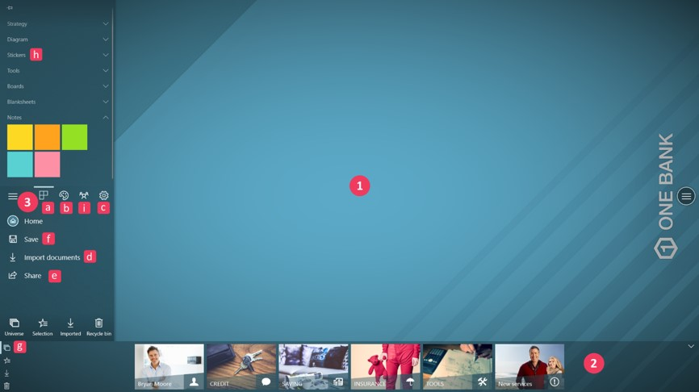

# Presentation 

Compositeur Digital UX is a unique solution to enhance professional presentations in face to face meetings. 
Leverage all your existing files (PDF, PowerPoint, images, videos) to achieve high value added sales or boost collaboration.

Compositeur Digital UX allows you to 
* Create links between your documents to deliver structured presentation and create an immersive story telling
* Bring live annotations to any document
* Add sticky notes on your important documents
* Live-import any document you need during your presentation
* Collaborate and bring your team’s ideas to life

Take your face-to-face presentations to the next level and unleash the power of interaction with your audience!

## Summary
* [Vocabulary](#vocabulary)
* [Overview](#overview)
  * [Samples](#samples)
  * [Universes](#universes)
  * [Projects](#projects)
  * [Workspace](#workspace)
    * [Open a document](#open-a-document)
    * [Manipulate a document](#manipulate-a-document)
    * [Close a document](#close-a-document)

## Vocabulary 

* **Universe** : a universe is a windows folder which contains a set of documents, images, video, 3D models which will be used during your working session. During your work through the workspace, changes to these files can be saved in different projects.
* **Projects** : a project contains all the work you have achieved in a universe : annotations, documents opened and manipulated, ect. Each project is attached to a universe.
* **Workspace** : the workspace allows you to open, visualize and manipulate various types of documents : images, pdf, powerpoints, video, ect... Using pencil, you can write annotations on your documents.
* **Source** : a source contains a set of universes. Three types of source exist :
   * *A local source* : it is a folder on your computer (e.g. the default source uses the path `<HD>\<user>\Documents\Compositeur Digital UX`. This folder contains universes which are saved on your computer.
   * *USB Key sources* : it is a folder on a USB key (e.g. `<KEY>\Compositeur Digital UX`). When you use USB keys, you can start a project on a device, save your project on your key, and then continue to work on your project using another device.
   * *Cloud sources* : it is Microsoft Teams channel or a SharePoint site of your organisation. You need an internet access and an Office365 tenant to use cloud sources.

## Overview

### Samples

Universe with interactive background, perfect for self-service devices!

Banking context, face-to-face meeting.

Industry, product review meeting.

### Universes

The Compositeur Digital UX start page presents all the universes available in a given source. 

1. The list of all the available sources. In this example, there is a local source (`Documents`), three cloud sources, and one usb source.
1. The `New` tab displays all the universes available in the source. 
1. The `Open` tab contains all the projects started on this source.
1. A refresh button allows you to reload the source if you have created new universes, or if you have deleted some universes.
1. The panel at the bottom allows you to quickly add new sources (local or cloud sources), to connect to your Office 365 tenant, and to access the settings of the app. From the settings you can add your Compositeur Digital license. 

You can start an empty workspace by clicking on:

### Projects

Clicking on "Open" drives you to the projects you have been working on. All the projects that you have saved will appear here.

1. Clicking on a project thumbnail will open the project exactly how you left it.
1. Clicking on the three dots will show a context menu which allows you to Share, Delete or display information about your project.
1. You can sort your projects by their names, the date they have been accessed, or the universe they are linked to. 
1. The refresh button will force the source to be refreshed. It will refresh both the universes and the projects.
1. The `New` tab will show you the universes available in the current source.

### Workspace

Once you have decided which project or universe you want to work on, tapping on the project/universe icon will launch the workspace.
The workspace is divided into 3 areas:

1. The workspace: a collaborative area, to display, manipulate and edit content.
1. A dock to browse and access your content.
1. The menu button, available on the right side and left side of the screen, useful to : 
   - a. Add notes, blanksheets, stickers or templates.
   - b. Change the ink type and color of your pen, use your finger to draw on documents, ect.
   - c. Access settings of your project: you can enable / disable options such as tape or rotation from this menu.
   - d. Import documents: select a list of file, paste content from your clipboard, take a screenshot of another app.
   - e. Share your work
   - f. Save your project
   - g. Visualize all your documents: selection, imported documents, recycle bin, universes.
   - h. Browse all the templates available: stickers, diagrams, boards...
   - i. Start web activities and imply your audience / attendees: [more details here](webactivities.md) 

#### Open a document

1. On the dock, tap on the folder to open it.
1. In the folder view, tap on any document to display it.
1. Your item is now displayed on the workspace.

#### Manipulate a document

Compositeur Digital UX has been designed to be used with tactile interactions and gestures.
The following gestures are supported:
1. Move.
1. Pinch / Spread to zoom in /out.
1. Rotation

#### Close a document

A document can be closed by tapping on the cross at the top right corner.

You can also close a document by throwing it away on the edges of your screen. If you apply enough strength, the document will be removed from the workspace. 

**Important** : a document that you have closed is never lost. You can retrieve it from "History".

Next : [Workflow](workflow.md)

[Back to User Guide](index.md)
