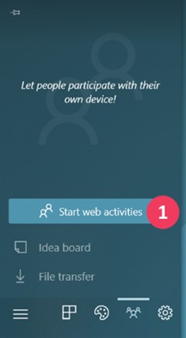
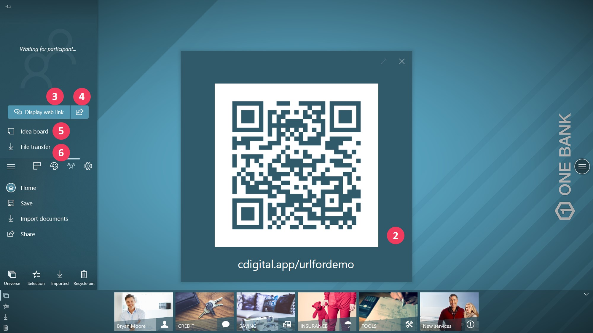
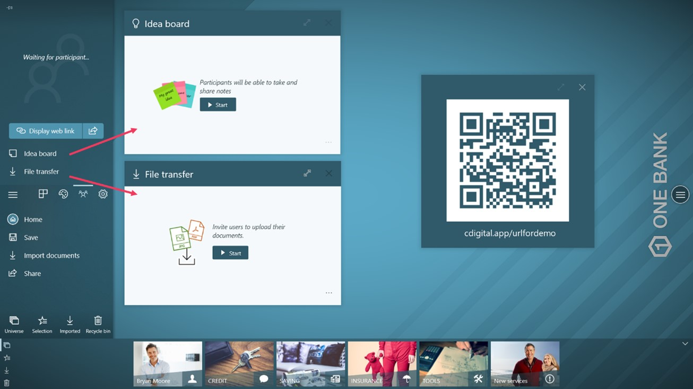
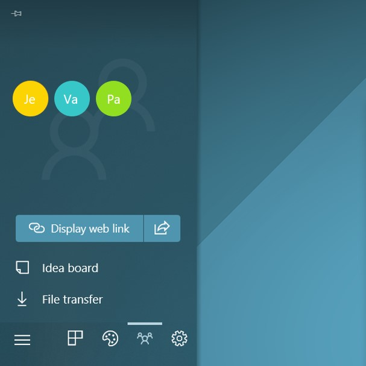
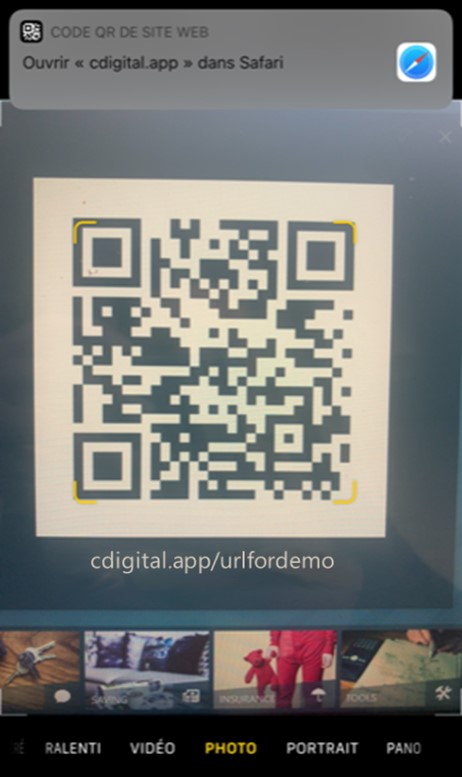
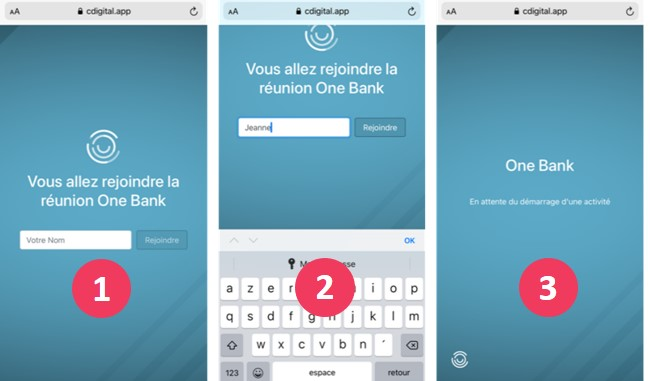
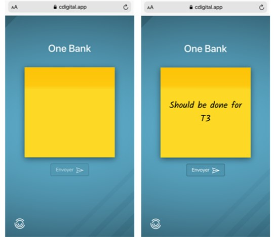
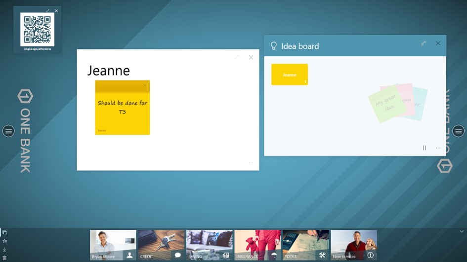
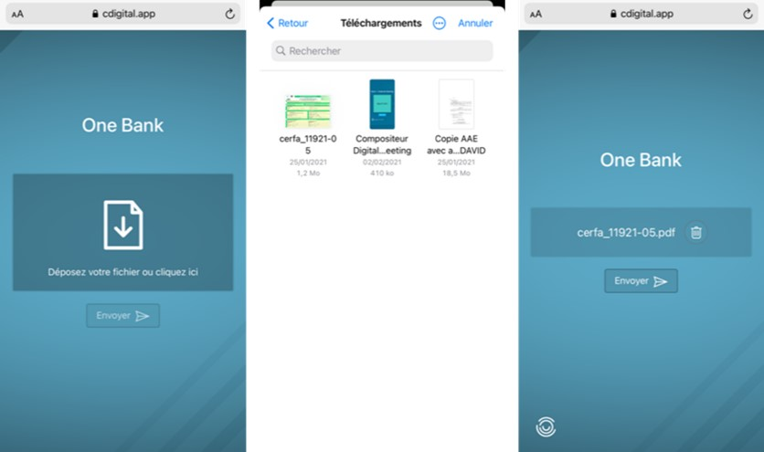
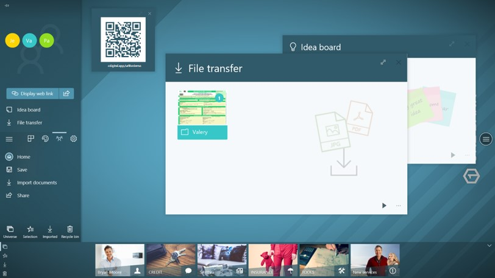

# Web activities

Web activities is a functionality that makes able an animator to exchange ideas through post-it and/or files with other users who participate at the same session.

## Point of view: animator ##

Once you have clicked on this icon, you can start web activities with the attendees, it will make them able to share post it and/or files that will appear in the universe.

1. First, click on `Start web activities` 

2. Then, a QR code appears on the workspace

3.	If you want to display again the QR code, click on the button `Display web link`
4.	If you want to share the QR code to the attendees, click on the icon *share*

Attendees can access the QR code url by several ways:

-	By their phone, by scanning the QR code directly through the screen
-	By their computer, by writing or pasting the url online
-	Or by clicking on the link they received if you have shared it by email for example (button 3)

5.	To make attendees able to share ideas on post it, click on `Idea board`
6.	To make attendees able to share files, click on `File transfer`

Then, one board will open for each one:

Once attendees have launched their session on their device, you will see their icon: 

In this example, 3 attendees have joined the activity. They access through the device they have chosen (mobile/desktop).

6.	Attendees are now able to share their post-it and files once you have clicked on the `Start` Button. 

## Point of view: attendee ##

The Companion works either with a mobile phone either with a computer.

*In this tutorial, we used the example of a mobile phone use, but the operation works the same from a computer.*

To open the link from the QR code:
•	The attendee enters the url in a search engine
•	or scans the QR code by its mobile phone:

**How to start an activity (post it or file transfer)?**

Once the attendee has joined the activity by opening the link:
1.	he is invited to enter his name to join the activity
2.	he has to write his name
3.	he eventually has to wait the animator to launch the activity 

*Meanwhile the animator can either start an* `Idea Board`*, either a* `File transfer`*.*

**If the animator starts an Idea board:**

The attendee can write an idea on a post it and click on `Share`. It will then appear in the universe:

**If the animator starts a File transfer:**

The attendee can now upload any file (image or pdf) and load it by cliking on `Share`. It will then appear in the universe:

The animator can now open the files and the notes by cliking on the folder.

The operations apply in the same way when the participant opens the link on his computer.

