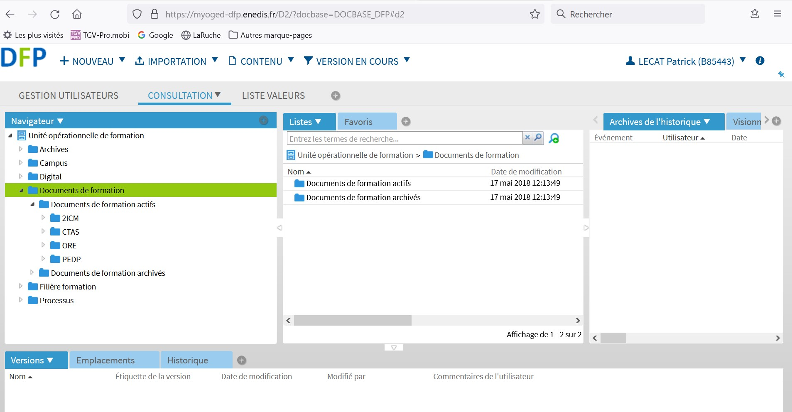

# Préparer son dossier de travail 

1. Ouvrir l'explorateur de fichiers
2. Accéder au dossier *C:\Users\\\<users>\Documents\\*
3. Ajouter un dossier *Compositeur Digital UX* si ce dossier n'existe pas. **Veuiller bien respecter les majuscules et les espaces!**
4. Ouvrir le dossier *Compositeur Digital UX*
5. Ajouter un nouveau dossier (il peut s'appeler comme bon vous semble).
6. Ouvrir le dossier précedemment créé.
7. Déposer des documents dans ce dossier. Il est possible de créer des dossiers et des sous-dossiers pour préparer une arborescence de contenus.

<video controls muted loop autoplay width="864" height="480">
	<source src="./media/create-universe.mp4" type="video/mp4">
</video>

**Rappel**

Le Compositeur Digital UX vous permet de visualiser les contenus suivants:
- Présentations (.pdf, .pptx, .ppsx)
- Vidéos (.mp4, mkv, .mov, .avi)
- Images (.gif, .png, .jpg, .webp)
- Modéles 3D (.obj, .3ds)

Tout autre type de fichier ne pourra être visualisé.

## Récupérer des contenus sur OGED

1. Se connecter à la plateforme OGED
2. Télécharger les contenus à présenter dans le dossier "Téléchargements".
3. Copier les fichiers téléchargés dans votre univers.

## [Prochaine étape : démarrer l'application](./start-app.md)

## Autres rubriques
* [**Démarrer l'application**](./start-app.md)
* [**Lancer un environnement**](./new-universe.md)
* [**Manipuler des documents**](./manipulate-doc.md)
* [**Annoter des documents**](./annotate.md)
* [**Ajouter des notes et des feuilles blanches**](./add-notes.md)
* [**Importer des documents en live**](./import-docs.md)
* [**Animer une session d'activités en ligne**](./companion.md)
* [**Préparer une sélection**](./prepare-selection.md)
* [**Partager sa sélection**](./share-selection.md)
* [**Enregistrer son projet**](./save-project.md)
* [**Retourner à l'écran d'accueil**](./back-home.md)
* [**Ouvrir un projet**](./open-project.md)
* [**Fermer l'application**](./close-app.md)
