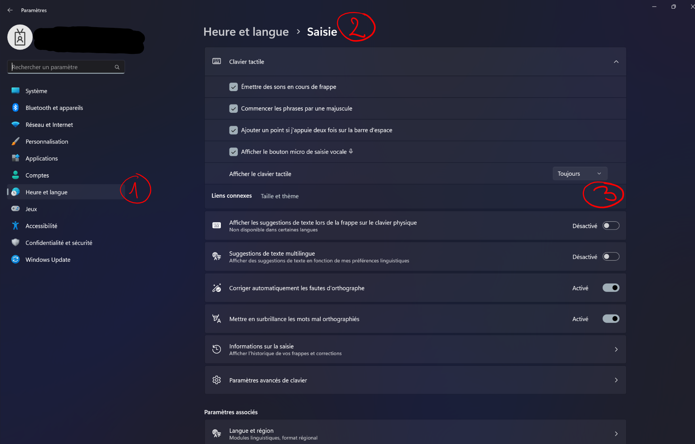

# Configurer le clavier tactile (Windows 11)

Ouvrir les paramètres Windows 11

1. Ouvrir la rubrique **Heure et langue**
2. Ouvrir la rubrique **Saisie**
3. Dans la rubrique *Clavier tactile*, s'assurer que le l'option *Afficher le clavier tactile* est configurée sur *Toujours*

Lorsque votre PC est connecté en fillaire à un dispositif tactile, si vous touchez une zone de texte, le clavier visuel sortira automatiquement.

## [&rarr; Prochaine étape : Démarrer l'application](./start-app.md)

## Autres rubriques
* [**Lancer un environnement**](./new-universe.md)
* [**Manipuler des documents**](./manipulate-doc.md)
* [**Annoter des documents**](./annotate.md)
* [**Ajouter des notes et des feuilles blanches**](./add-notes.md)
* [**Importer des documents en live**](./import-docs.md)
* [**Animer une session d'activités en ligne**](./companion.md)
* [**Préparer une sélection**](./prepare-selection.md)
* [**Partager sa sélection**](./share-selection.md)
* [**Enregistrer son projet**](./save-project.md)
* [**Ouvrir un projet**](./open-project.md)
* [**Fermer l'application**](./close-app.md)

* [**Préparer son dossier de travail**](./prepare-content.md)
* [**Appliquer un fond d'écran personnalisé**](./change-background.md)