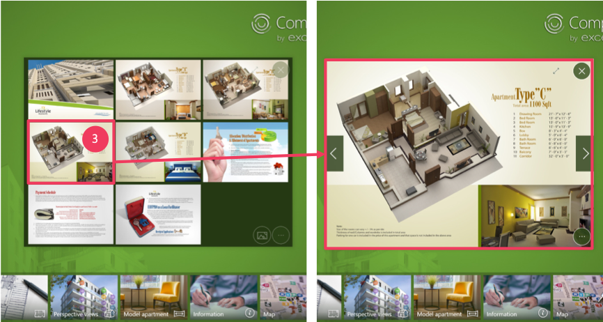
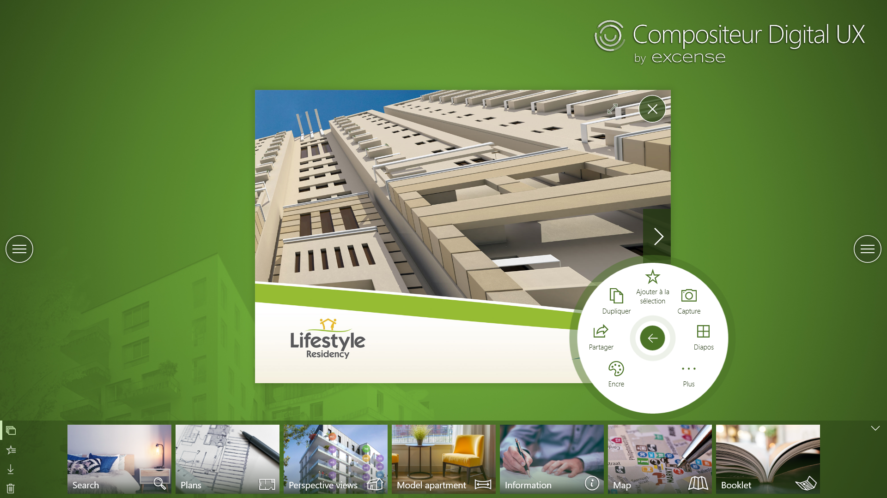

# Aide-mémoire - usage immobilier

Dans cet aide-mémoire, retrouvez l'intégralité des fonctionnalités essentielles à l'usage du Compositeur Digital dans le secteur immobilier. 

## Démarrage du Compositeur Digital

## Utilisation du mode Diaporama

*Affichage de l'ensemble des slides composant une présentation, de l'ensemble des images d'un diaporama...*

1. Ouverture du menu relatif au document
2. Sélection du mode Diaporama

3. Sélection d’une page ou d’un slide à afficher

4. Mode d'extraction des pages
5. Choix des pages à extraire

## Utilisation de la fonctionnalité Rotation

## Utilisation de la fonctionnalité Scotch

## Annotation de documents

## 
