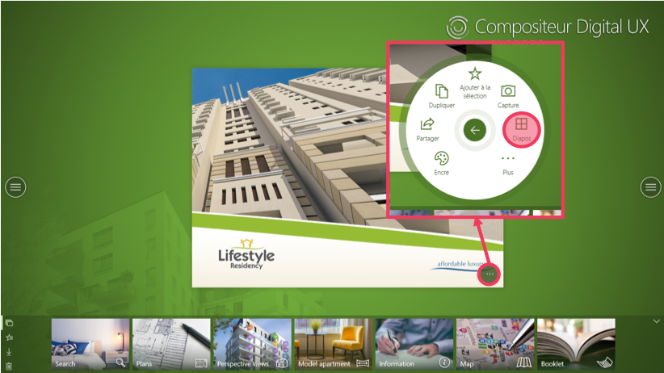

# Aide-mémoire - usage immobilier

Dans cet aide-mémoire, retrouvez l'intégralité des fonctionnalités essentielles à l'usage du Compositeur Digital dans le secteur immobilier. 

## Démarrage du Compositeur Digital

## Utilisation du mode Diaporama

*Affichage de l'ensemble des slides composant une présentation, de l'ensemble des images d'un diaporama...*

## Utilisation de la fonctionnalité Rotation

## Utilisation de la fonctionnalité Scotch

## Annotation de documents

## 
