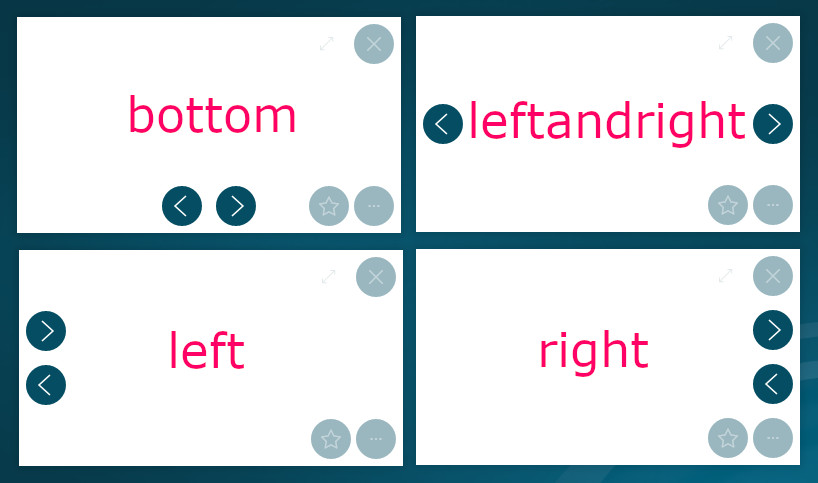

# Paramètres avancés : métadonnées

Vous pouvez modifier le comportement d'un document ou les actions associées en utilisant des paramètres spécifiques décrits dans un fichier nommé `_meta.txt`.

Pour modifier le comportement d'un dossier, le méta-fichier doit être placé dans le dossier cible, et nommé `_meta.txt`.

Pour modifier le comportement d'un document, le méta-fichier doit être nommé d'après le nom du fichier du document suivi du suffixe `_meta` et de l'extension `txt`. Il doit être enregistré au même endroit que le document cible.

> Exemple : pour un fichier nommé `1 - image.jpg`, le méta-fichier correspondant doit être nommé comme suit : `1 - image_meta.txt`.

Dans le méta-fichier, chaque ligne (appelée `meta`) doit décrire un paramètre en utilisant la structure suivante : `metaName = valeur`

Une valeur binaire (vrai ou faux) est décrit comme suit :  `metaName = true`. Sa valeur par défaut est "faux". Les valeurs `1` (true) et `0` (false) peuvent également être utilisées.

Pour appliquer un comportement spécifique à un ensemble de documents, utilisez le préfixe `*.` sur ll paramètre et enregistrez le fichier méta dans le dossier contenant l'ensemble des documents visés

>  Exemple : `*.table.hideCommands = true`

## Résumé 
* [Types de valeurs](#types-de-valeurs)
* [Métadonnées prises en charge](#métadonnées-prises-en-charge)
* [Métadonnées spécifiques au contenu](#métadonnées-spécifiques-au-contenu)
  * [Diaporama](#diaporama)
  * [Vidéo et audio](#video-et-audio)
  * [Web](#web)
  * [simulateur de prêt](#simulateur-de-prêt)
  * [Simulateur d'épargne](#simulateur-d'épargne)
  * [Objets 3D](#objets-3d)
  * [Interface de recherche](#interfaces-de-recherche)
* [Valeurs partagées](#valeurs-partagees)

## Types de valeurs

|Type         | Description                          | Exemples|
|:------------|:-------------------------------------|:--------|
| `texte`     | une chaîne de caractères             | `du texte`, `Mon document` |
| `nombre`    | un nombre entier ou décimal          | `123`, `123.45` |
| `dimension` | taille, en pixels ou un pourcentage, de la visualisation du contenu | `400`, `75%` |
| `booléen`   | vrai ou faux / actif ou inactif      | `true`/`false`, `1`/`0` |
| `couleur`   | code couleur hexadécimal ou code rgb | `#AAAAAA`, `#f03b5e`, `112, 12, 67` |

## Métadonnées prises en charge

| Paramètre                         | Type         | Par défaut   | Description |
|:--------------------------------- |:-------------|:-------------|:------------|
| `culture`                         | `texte`      | -            | indique la langue utilisée dans l'univers. Les valeurs prises en charge sont "fr" ou "en" |
| `canStick`                        | `booléen`    | false        | indique que l'objet peut être collé comme une note |
| `canWrite`                        | `booléen`    | false        | indique que du texte peut être tapé sur cet objet |
| `desiredHeight`                   | `dimension`  | 400          | définit la hauteur par défaut du document |
| `desiredWidth`                    | `dimension`  | 400          | définit la largeur par défaut du document |
| `desiredSizeBehavior`             | `auto|fit|fill` | auto   | définit la façon dont les dimensions `desiredWidth` and `desiredHeight` sont appliquées à la taille du document. `auto` ajuste la taille en conservant la longuer de la diagonale, `fit` ajuste à la plus grande taille possible contenue dans les dimensions souhaitées, `fill` ajuste à la plus petite taille possible recouvrant les dimensions souhaitées |
| `desiredPosition(.x|.y)`          | `position`   | auto         | contrôle l'endroit d'apparition du document. Définir une valeur relative pour `desiredPosition.x` et `desiredPosition.y` (ex `desiredPosition.x=50%`) ou une valeur prédéfinie parmis `center`, `top`,`left`, `right`,`bottom`, `topleft`, `topright`, `bottomleft`, `bottomright` (ex `desiredPosition=center`) |
| `isPaper`                         | `booléen`    | false        | supprime le fond des boutons du document (boutons d'action et de fermeture)|
| `hideBottomBarDots`               | `booléen`    | false        | cache le bouton de la barre inférieure lorsque celle-ci est réduite |
| `hideBottomBar`                   | `booléen`    | false        | cache la barre inférieure lorsque celle-ci est réduite |
| `bottombar.showQuickHideAction`   | `booléen`    | false        | affiche un bouton permettant de cacher la barre inférieure |
| `maxHeight`                       | `dimension`  | -            | définit la hauteur maximale |
| `maxWidth`                        | `dimension`  | -            | définit la largeur maximale |
| `minHeight`                       | `dimension`  | -            | définit la hauteur mimimale |
| `minWidth`                        | `dimension`  | -            | définit la largeur minimale |
| `name`                            | `texte`      | nom du fichier | change le nom affiché du document|
| `subname`                         | `text`       | -            | définit un texte sedondaire, affiché sous le nom dans certaines vues (ex. résultats de recherche) |
| `hidden`                          | `booléen`    | false        | rend le document non visible dans la barre de contenus, les vues dossier our les résultats de recherche |
| `noChromeButtons`                 | `boolean`    | false        | cache les boutons d'action (fermer, menu).|
| `noChromeShadow`                  | `boolean`    | false        | désactive l'ombre sous le document.|
| `noChrome`                        | `booléen`    | false        | cache les boutons d'action (fermer, menu), et l'ombre sous le document |
| `simpleshadow`                    | `booléen`    | false        | affiche une ombre simlifié|
| `cornerRadius`                    | `dimension`  | 8            | taille des arrondis aux coins du documents, valeur numérique en pixels ou pourcentaige de la plus petite dimension du document |
| `noRoundedCorner`                 | `booléen`    | false        | désactive les arrondis aux coins des documents |
| `orientation`                     | `nombre`     | 0            | fait pivoter le document : `-90` pour tourner à gauche, `90` pour tourner à droite ou `180` pour retourner le document |
| `table.noClose`                   | `booléen`    | false        | empêche la fermeture du document (le bouton de fermeture est désactivé et la projection hors de l'écran ne se ferme pas) |
| `table.hideCommands`              | `booléen`    | false        | cache les boutons de contrôle d'un document (page précédente/suivante, contrôles de lecture vidéo...) |
| `table.noRotate`                  | `booléen`    | false        | empêche la rotation du document |
| `table.noInertia`                 | `booléen`    | false        | empêche le déplacement inertiel des documents. Note : désactive la fermeture par lancer sur le côtés |
| `table.viewer`                    | `cdux|extern`| cdux         | L'utilisation de `cdux` assure que le lien `cdurl` sera affiché dans le Compositeur Digital UX. Avec `extern`, le document est ouvert en utilisant le viewer natif. |
| `themeColor`                      | `couleur`    | -            | force un thème couleur pour l'univers/élément et son contenu | 
| `table.showOnStart`               | `booléen`    | false        | ouvre le document automatiquement au lancement de l'univers | 
| `noHistory`                       | `boolean`    | false        | le document ne sera pas enregistré dans la corbeille à sa fermeture | 
| `hideLinkLabel`                   | `booléen`    | false        | cache le nom du document dans la barre inférieure de l'univers |
| `hideLinkTypeIcon`                | `boolean`    | false        | cache l'icone de type de document dans les vues de dossier |
| `table.alwaysBehind`              | `boolean`    | false        | force le document à rester en arrière plan |
| `table.alwaysOnTop`               | `boolean`    | false        | force le document à rester au premier plan |
| `toolbox.startOpened`             | `boolean`    | false        | les éléments de la boite à outils seront visibles lors de l'affichage de la barre latérale |

#### Annotations

Définissez la couleur et la taille du stylet à l'aide des paramètres suivants :

| Metadata Key      | Type         | Default   | Description |
|:----------------- |:-------------|:----------|:-|
| `ink.color`       | `yellow|orange|beige|red|pink|prune|violet|blue|pervenche|turquoise|celadon|emerald|green|gray|black|white|theme|usercolor|customcolor` | black | définit la couleur par défaut |
| `ink.drawingColor`| `color` | - | couleur utilisée lorsque `ink.color` est définit à `customcolor` |
| `ink.penName`     | `fine|thick|marker` | fine | définit la taille du stylet |

#### Actions du menu

Les actions disopnibles dans le menu de chaque documents sont configurable individuellement. Définissez les paramètres suivant en utilisant `<key>` parmis les actions listées ci-après. 
> Example: 
>
>`actions.saveas.disabled = true`  to hide the "Save as" action
>
>`actions.selection.location = shortcut` to give quick access to the selection action

| Paramètre                  | Type         | Default   | Description |
|:-------------------------- |:-------------|:----------|:-|
| `actions.disabled`         | `boolean`    | false     | cache le bouton d'accès au menu |
| `actions.<key>.disabled`   | `boolean`    | false     | cache l'action `<key>` |
| `actions.<key>.location`   | `menu` or `shortcut`    | menu     | définit si l'action `<key>` doit apparître dans le menu ou en accès rapide à côté du menu |

Actions configurables :

| Clef d'action | Description |
|:--------------|-------------|
|`capture`      | Crérer une image de capture du document tel qu'affiché | 
|`selection`    | Ajouter ou retirer le document de la sélection | 
|`duplicate`    | Dupliquer le document | 
|`share`        | Partager le docuement |
|`saveas`       | Enregistrer le document sur l'ordinateur |
|`open`         | Ouvrir le docuement en dehors de l'application |
|`playpause`    | Ouvrir le docuement en dehors de l'application |

## Métadonnées spécifiques au contenu

### Diaporama

| Paramètre                         | Type      | Default | Description |
|:--------------------------------- |:----------|:--------|:-|
| `slideshow.controls.position`         | `auto|bottom|left|right|leftandright` | auto   | définit la position ou s'affichent les boutons page suivante/précédente |
| `slideshow.controls.hide`             | `boolean` | false   | cache les boutons page suivante/précédente |

WhLorsque la position est paramétré `auto`, la position sera `leftandright` si la rotation des documents est activée, sinon `bottom`.

### Video et audio

| Paramètre                         | Type      | Par défaut | Description |
|:--------------------------------- |:----------|:-----------|:------------|
| `video.autoplay`                  | `booléen` | true       | démarre la lecture de la vidéo sur l'écran |
| `video.autoplay.delay`            | `nombre`  | 0          | retarde la lecture automatique du nombre de secondes spécifié |
| `video.autoclose`                 | `booléen` | false      | ferme la vidéo lorsque la lecture arrive à son terme |
| `video.autoclose.delay`           | `nombre ` | 0          | retarde la fermeture automatique du nombre de secondes spécifié |
| `video.mute`                      | `booléen` | false      | définit si une vidéo est mise en sourdine ou non  |
| `video.rewind`                    | `booléen` | false      | revient à la première image quand la vidéo se termine |
| `video.loop`                      | `booléen` | false      | reprend au début lorsque la vidéo se termine |
| `video.controls.alwaysvisible`    | `booléen` | false      | force l'affichage des commandes de lecture vidéo |
| `video.controls.hide`             | `booléen` | false      | cache les contrôles de lecture vidéo en permanence |
| `video.background.color`          | `couleur` | -          | Couleur visible le temps que la vidéo se charge, format `#RRGGBB`, ou `#AARRGGBB` pour la transparence (alpha) |

### Web

| Paramètre                         | Type      | Par défaut | Description |
|:--------------------------------- |:----------|:-----------|:------------|
| `web.manipulationMode`            | `nombre`  | 0          | Si "1", l'utilisateur devra activer le mode de navigation, alors l'affichage se comportera comme un navigateur. Si `0`, le mode de navigation sera réduit. |
| `web.showChrome`                  | `booléen` | true       | affiche une barre de navigation en haut de la vue |
| `web.viewport.width`              | `nombre`  | 1000       | Définit la largeur par défaut de la vue de la page |
| `web.viewport.height`             | `nombre`  | 800        | Définit la hauteur par défaut de la vue de la page |
| `table.viewer`                    | `texte`   | extern     | Force l'ouverture du lien web dans votre navigateur |

### Simulateur de prêt

| Paramètre                           | Type     | Par défaut         | Description |
|:-------------------------------------------- |:---------|:-------------------|:------------|
| `simulator.additionalCostsRateDefaultValue`  | `nombre` | 0                  | définit la valeur par défaut du taux des coûts additionnels |
| `simulator.additionalCostsRateLabel`         | `texte`  | `Coûts additionnels`| définit l'étiquette de la ligne des coûts additionnels | 
| `simulator.additionalCostsRateMinValue`      | `nombre` | 0                  | définit la valeur minimale du taux de coûts additionnels |
| `simulator.additionalCostsRateMaxValue`      | `nombre` | 50                 | définit la valeur maximale du taux des coûts additionnels |
| `simulator.additionalCostsRateTickFrequency` | `nombre` | 1                  | définit l'intervalle entre deux valeurs pour le taux des coûts additionnels |
| `simulator.creditMaxValue`                   | `nombre` | 800000             | définit la valeur maximale d'un prêt |
| `simulator.creditTickFrequency`              | `nombre` | 5000               | définit l'intervalle entre deux valeurs pour un prêt |
| `simulator.creditDefaultValue`               | `nombre` | 300000             | définit la valeur du prêt par défaut |
| `simulator.durationMinValue`                 | `nombre` | 5                  | définit la durée la plus courte d'un prêt |
| `simulator.durationMaxValue`                 | `nombre` | 30                 | définit la durée la plus longue d'un prêt |
| `simulator.durationTickFrequency`            | `nombre` | 1                  | définit l'intervalle entre deux valeurs pour une durée de prêt |
| `simulator.durationDefaultValue`             | `nombre` | 20                 | définit la durée par défaut d'un prêt |

### Simulateur d'épargne

| Paramètre                           | Type     | Par défaut         | Description |
|:-------------------------------------------- |:---------|:-------------------|:------------|
| `simulator.depositFrequencyDefault`          | `Month|Quarter|Year`  | Month | définit la valeur par défaut de la fréquence de dépôt |
| `simulator.interestRateMinValue`             | `nombre` | 0                  | définit la valeur minimale du taux d'intérêt |
| `simulator.interestRateMaxValue`             | `nombre` | 10                 | définit la valeur maximale du taux d'intérêt  |
| `simulator.interestRateDefaultValue`         | `nombre` | 2.75               | définit la valeur par défaut du taux d'intérêt |
| `simulator.regularDepositMinValue`           | `nombre` | 10                 | définit la valeur minimale des dépôts |
| `simulator.regularDepositMaxValue`           | `nombre` | 20000              | définit la valeur maximale des dépôts |
| `simulator.regularDepositTickFrequency`      | `nombre` | 100                | définit l'intervalle entre deux valeurs pour un dépôt |
| `simulator.savingsTermMinValue`              | `nombre` | 0                  | définit la durée la plus courte d'un plan d'épargne |
| `simulator.savingsTermMaxValue`              | `nombre` | 30                 | définit la durée la plus longue d'un plan d'épargne |
| `simulator.savingsTermDefaultValue`          | `nombre` | 20                 | définit la durée par défaut d'un plan d'épargne |
| `simulator.savingsTermTickFrequency`         | `nombre` | 1                  | définit l'intervalle entre deux valeurs pour la durée d'un plan d'épargne |
| `simulator.startingDepositMinValue`          | `nombre` | 0                  | définit la valeur minimale du montant du dépôt de départ |
| `simulator.startingDepositMaxValue`          | `nombre` | 800000             | définit la valeur maximale du montant du dépôt de départ |
| `simulator.startingDepositTickFrequency`     | `nombre` | 5000               | définit l'intervalle entre deux valeurs pour un montant de dépôt initial |

### Objets 3D

| Paramètre                | Type     | Par défaut | Description |
|:--------------------------------- |:---------|:-----------|:------------|
| `obj3D.backgroundcolor`           | `couleur`| #dce1e1    | définit une couleur de fond unie |
| `obj3D.camera.h`                  | `nombre` | 0          | définit l'azimut par défaut (rotation horizontale) pour la position de la caméra |
| `obj3D.camera.v`                  | `nombre` | 0          | définit l'inclinaison par défaut (rotation verticale) pour la position de la caméra|
| `obj3D.renderingmode`             | `Normal|Transparent|WireFrame`  | Normal     | définit le mode de rendu de l'objet |

### Interfaces de recherche

| Paramètre                | Type     | Par défaut | Description |
|:----------------------------------|:---------|:-----------|:------------|
| `catalog.resultsMaxCount`         |`nombre`  | 40         | Le nombre maximum de résultats qui peuvent être visualisés dans la page de résultats. |

## Valeurs partagées

Certaines valeurs peuvent être partagées entre différents éléments, par exemple des informations sur un contact dans un quiz ou le résultat d'un prêt hypothécaire.

| Clé partagée                     | Type      | Description |
|:---------------------------------|:----------|:------------|
| `firstName`                      | `texte`   | définit le prénom du contact actuel |
| `lastName`                       | `texte`   | définit le nom du contact actuel |
| `email`                          | `texte`   | définit l'email du contact actuel |
| `phoneNumber`                    | `texte`   | définit le numéro de téléphone du contact actuel |
| `organization`                   | `texte`   | définit l'organisation du contact actuel |
| `finance.budget`                 | `nombre`  | définit le montant du prête hypothécaire du contact actuel |

[Retour à Organiser vos contenus](index.md)
