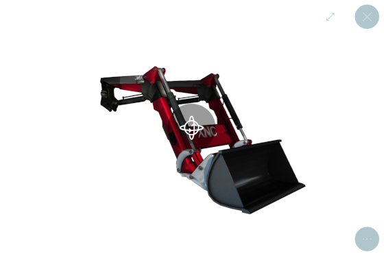
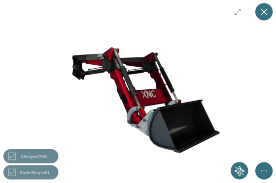
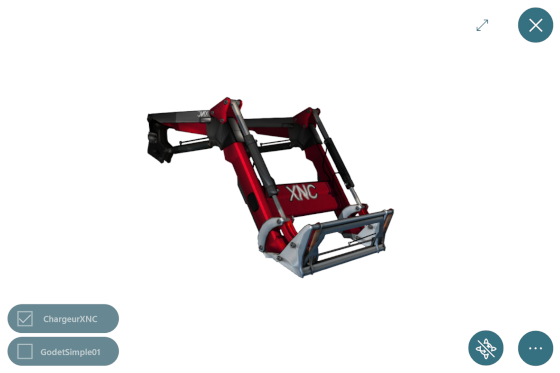
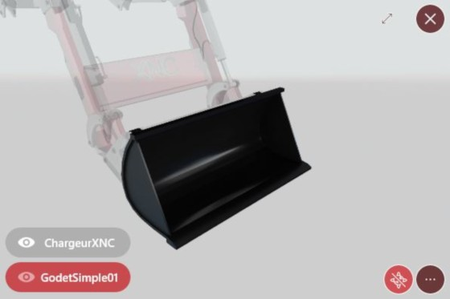
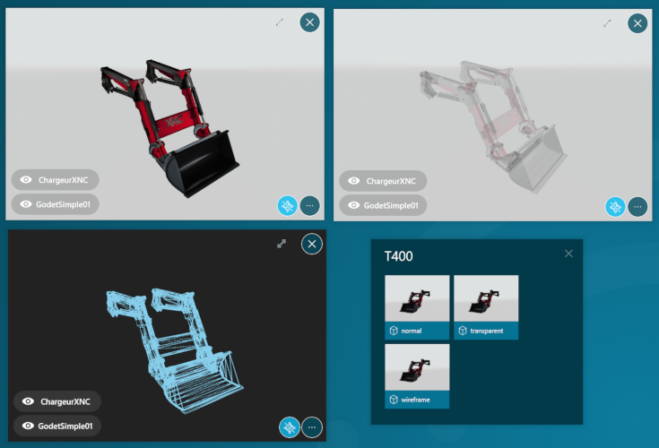

# Objects 3D

## Résumé
* [Description](#description)
* [Actions dans Compositeur Digital UX](#actions-dans-Compositeur-Digital-UX)
* [Extension de dossier](#extension-de-dossier)
* [Créer un objet 3D](#créer-un-objet-3d)
* [Fond de scène](#fond-de-scène)
* [Métadonnées disponibles](#métadonnées-disponibles)
* [Télécharger un exemple](#télécharger-un-exemple)

## Description 

Ce type de contenu vous permet de visualiser et de manipuler directement des objets 3D (`.3ds`, `.obj`).

Pour interagir avec un objet 3D, appuyez sur le bouton de manipulation au centre de l'objet : cela lance le mode de manipulation.

En mode manipulation, faites glisser votre doigt sur l'objet pour le faire pivoter. Si vous ne touchez pas l'objet pendant 10 secondes en mode de manipulation, le mode de manipulation sera automatiquement désactivé et votre objet se comportera normalement lorsque vous le toucherez.
Vous pouvez également appuyer sur le bouton 'Fin de la manipulation' (à côté du bouton d'action) pour mettre fin à la manipulation.

Lorsque vos objets en 3D sont composés de différents fichiers, vous pouvez sélectionner la partie de l'objet que vous souhaitez afficher, ou mettre l'accent sur une partie spécifique.

Pour masquer/afficher une partie, appuyez sur le symbole de l'œil à côté du nom de la partie que vous souhaitez masquer/afficher. 

Pour mettre/supprimer l'accent sur une pièce, appuyez sur son nom.

## Actions au sein de Compositeur Digital UX

Les objets 3D prennent en charge l'action suivante. Pour avoir un aperçu complet de chaque action, [voir la section Actions](actions.md)

**Menu des actions**

| Capturer | Dupliquer | Ouvrir dans l'app native | Enregistrer sous | Sélection | Partager | 
|:--------:|:---------:|:------------------------:|:----------------:|:---------:|:--------:|
| &#x2714; | &#x2714;  |        &#x2716;          |   &#x2716;       | &#x2714;  | &#x2716; |

**Interaction avec le contenu**

| Mode manipulation | Focus sur une partie |  Afficher/Masquer la partie |
|:-----------------:|:---------------------|:----------------------------|
| &#x2714;          | &#x2714;             | &#x2714;                    |

## Extension de dossier

Pour utiliser un objet 3d, mettez les modèles et tous les fichiers joints (material lib, textures, bitmaps) dans un dossier, et ajoutez l'extension `.3ds` ou `.obj` à la fin du nom de votre dossier.
A l'intérieur de votre dossier d'objets 3d, n'utilisez que les fichiers qui se terminent par `.3ds`, `.bmp`, `.dds`, `.jpeg`, `.jpg`, `.mtl`, `.obj` ou `.png`.

## Créer un objet 3D

1. Dans votre dossier environnement, créez un dossier nommé `<Nom de votre modèle 3D>.3ds` (par exemple `My loader.3ds`).
1. Glissez et déposez dans ce dossier tous les fichiers qui composent vos modèles 3d.
1. (Optionnel) Ajoutez une image (`.jpg` ou `.png`) nommée `_preview` pour changer la vignette.

## Arrière-plan

Vous pouvez personnaliser l'arrière-plan de la scène. Par défaut, si aucune `skybox`, aucun fond ou aucune couleur n'est défini, nous utilisons un fond d'image par défaut. Vous pouvez définir : 

1. Une texture de skybox (fichier `.dds`) qui sera mappée dans le fond de la scène. Elle doit être nommée `_skybox.dds`.
1. Un fichier d'arrière-plan nommé `_background.(jpg, png, jpeg)`.
1. Un méta-fichier avec une ligne `obj3D.backgroundcolor = <color>` pour définir une couleur de fond.

> Lombre portée est désactivée lorsqu'une texture de skybox est utilisée

## Métadonnées disponibles

| Clé de métadonnées                | Type     | Par défaut | Description |
|:--------------------------------- |:---------|:-----------|:-|
| `obj3D.backgroundcolor`           | `couleur`  | #dce1e1  | définit une couleur de fond unie |
| `obj3D.camera.h`                  | `nombre` | 0          | définit l'azimut par défaut (rotation horizontale) pour la position de la caméra |
| `obj3D.camera.v`                  | `nombre` | 0          | définit l'inclinaison par défaut (rotation verticale) pour la position de la caméra |
| `obj3D.renderingmode`             | `normal|transparent|wireframe`   | normal    | définit le mode de rendu de l'objet |
| `obj3D.disableShadow`             | `booléen`| false      | désactive le plan de sol et l'ombre portée  |

[Accéder aux métadonnées communes](../advanced_setting.md#résumé)

## Téléchager un exemple

Un univers de démonstration qui contient des exemples de contenus 3D est disponible, [essayez-le!](../../../en/organise_content/Demo-Universe.zip) &#x1f604;

Suivant : [Livre d'or (format Compositeur Digital UX)](guestbook.md)

[Retour aux Contenu pris en charge](index.md)
