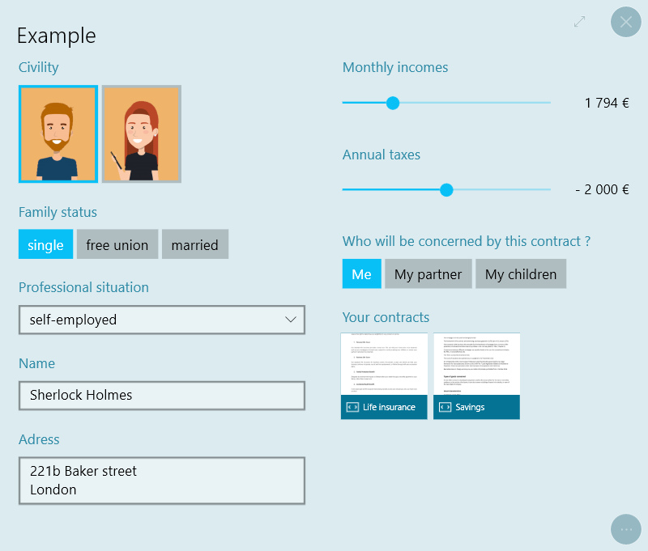
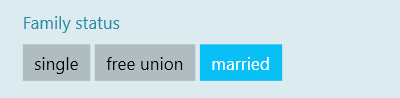
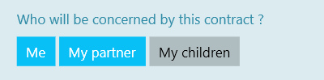
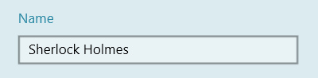
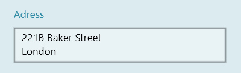
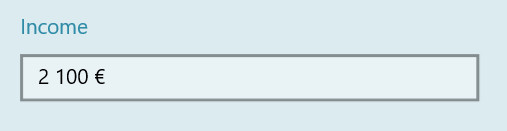
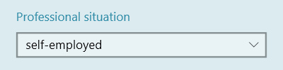
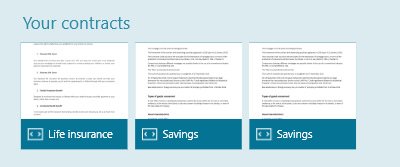
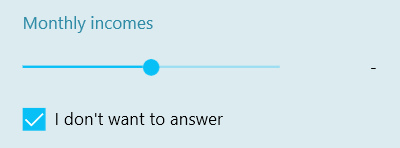
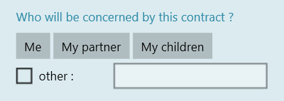

# Formulaire

## Résumé
* [Description](#description)
* [Actions dans Compositeur Digital UX](#actions-dans-Compositeur-Digital-ux)
* [Extension de dossier](#extension-de-dossier)
* [Contenus : `questions.xml`](#contents)
* [Organiser les éléments](#organiser-les-éléments)
* [Types d'entrée](#types-saisie)
   * [Choix unique](#choix-unique)
   * [Choix multiple](#choix-multiple)
   * [Texte sur une seule ligne](#texte-sur-une-seule-ligne)
   * [Texte sur plusieurs lignes](#texte-sur-plusieurs-lignes)
   * [Slider](#slider)
   * [Nombre](#numéro)
   * [Liste déroulante](#liste-déroulante)
* [Lier des documents](#types-de-présentateurs)
   * [Documents](#documents)
* [Autres valeurs](#autres-valeurs)
* [Visibilité des éléments](# visibilité-des-éléments)
* [Téléchargez un exemple](#télécharger-un-exemple)

## Description

Ce type de contenu vous permet d'afficher un formulaire interactif qui vous aidera à collecter des informations.



## Actions dans Compositeur Digital UX

Les formulaires prennent en charge les actions suivantes. Pour avoir un aperçu complet de chaque action, [voir la section Actions](actions.md)

**Menu des actions**

| Capturer | Dupliquer | Ouvrir dans l'app native | Enregistrer sous | Sélection | Partager |
|:--------:|:---------:|:------------------------:|:----------------:|:---------:|:--------:|
| &#x2716; | &#x2714;  | &#x2716;                 | &#x2716;         | &#x2714;  | &#x2716; |

**Interaction avec le contenu**

| Ouvrir des documents | Questions |
|:--------------------:|:---------:|
| &#x2714;             | &#x2714;  |


## Extension de dossier

Pour créer un formulaire, placez tous les éléments dont vous avez besoin dans un dossier, et ajoutez l'extension ".form" à la fin du nom de votre dossier.

À l'intérieur de votre dossier, fournissez un fichier appelé `_questions.xml`.

## <a name="contents"></a>Contents : `_questions.xml`

Un formulaire est composé de petits éléments pour présenter ou collecter des informations : 
* `<input>` pour collecter des informations
* `<presenter>` pour afficher les informations

Ils peuvent tous deux être décrits avec les attributs suivants :
* `type` : à quoi ressemblera l'élément (voir les sections [Types d'entrée](#types-saisie) et [Types de présentateur](#types-de-présentateurs))
* `text` : le titre ou la question affiché au-dessus de l'élément
* `info-bulle` : ajoute un point d'interrogation à côté du titre pour afficher le texte donné ici
* `valuekey` : stocker et récupérer la valeur d'une entrée sous cette clé
* `visiblewhen` : ne montrer l'élément que lorsque la condition donnée est remplie (voir la section [Visibilité des éléments] (#visibilité-des-éléments))

## Organiser les éléments
Les entrées et les présentateurs peuvent être écrits dans l'ordre d'apparition à l'intérieur de la balise `<form>` ou organisés en colonnes grâce à la balise `<section>`.

*Exemples
Quatre entrées affichées dans une seule colonne :
```xml
<form>
    <input />
    <input />
    <input />
    <input />
</form>
```

Quatre éléments affichés dans deux colonnes :
```xml
<form>
    <section>
        <input />
        <input />
    </section>
    <section>
        <input />
        <input />
    </section>
</form>
```

## <a nom="types-saisie"></a>Types d'entrée

### Choix unique



```xml
<input type="singlechoice" text="État civil">
    <choice text="célibataire" />
    <choice text="union libre" />
    <choice text="marrié" />
</input>
```
Ajoutez autant de balises `<choice/>` que vous avez de réponses dans l'entrée.
Les réponses peuvent aussi être des images si vous mettez des images dans le dossier du formulaire, en utilisant leurs noms pour remplir l'attribut `image`.
Si les deux attributs 'texte' et 'image' sont remplis, le texte sera affiché en bas de l'image.


```xml
<input type="singlechoice" text="Civilité" >
    <choice image="homme.png" />
    <choice image="femme.png" />
</input>
```

### Choix multiple



```xml
<input type="multiplechoice" text="Qui sera concerné par ce contrat ?">
    <choice text="Moi" />
    <choice text="Mon partenaire" />
    <choice text="Mes enfants" />
</input>
```
### Texte sur une seule ligne
Une zone de texte libre sur une seule ligne.



```xml
<input type="singlelinetext" text="Nom" />
```
### Texte sur plusieurs lignes



```xml
<input type="multiplelinetext" text="Adresse" />
```
### Slider


```xml
<input type="slider" text="Revenus mensuels" minvalue="0" maxvalue="8000" format="# ##0 €" minlabel="pas de revenu" maxlabel="+ 8 000 €" />
```

* Les attributs `minlabel` et `maxlabel` ne sont pas obligatoires mais permettent de personnaliser les valeurs affichées.
* Pour les valeurs possibles de `format`, voir [les formats standard](https://docs.microsoft.com/en-gb/dotnet/standard/base-types/standard-numeric-format-strings) et [formats personnalisés](https://docs.microsoft.com/en-gb/dotnet/standard/base-types/custom-numeric-format-strings)
* l'attribut `frequence` définit l'intervalle entre deux valeurs possibles

Vous pouvez également spécifier toutes les réponses possibles du curseur avec les balises `<choice\>` :

[choix du curseur](../../../en/img/content_form_sliderChoices.jpg)

```xml
<input type="slider" text="Taxes annuelles">
    <choice text="pas de taxes" />
    <choice text="- 2 000 €" />
    <choice text="+ 2 000 €" />
</input>
```

### Nombre
Pour saisir un nombre précis.



```xml
<input type="number" text="Revenu" format="# ##0 €" minvalue="0" maxvalue="10000" />
```
* `minvalue` et `maxvalue` sont des attributs non obligatoires, la valeur saisie le sera.
* Pour les valeurs de `format` possibles, voir [les formats standards](https://docs.microsoft.com/en-gb/dotnet/standard/base-types/standard-numeric-format-strings) et [les formats personnalisés](https://docs.microsoft.com/en-gb/dotnet/standard/base-types/custom-numeric-format-strings)
* Par défaut,cette entrée empêchera la saisie de caractères non numériques. Ajoutez 
```xml 
<input type="number" allowText="true"/>
```
pour permettre la saisie de caractères non numériques si vous préférez. 

### Liste déroulante
Pour lister une grande quantité de réponses dans un espace réduit, il est recommandé d'utiliser une `combobox` au lieu d'un `singlechoice`.


```xml
<input type="combobox" text="Situation professionnelle">
    <choice text="employé" />
    <choice text="chômeur" />
    <choice text="indépendant" />
</input>
```

## <a nom="types-présentateur"></a>Types de présentateurs

### Documents



```xml
<presenter type="documents" text="Vos contrats">
    <entry text="Assurance vie" source="contract 1.pdf" />
    <entry source="Savings.pdf" />
</presenter>
```

## Autres valeurs

Un `<choice>` de type `novalue` ajoute une case à cocher sous l'entrée pour désélectionner toutes les autres réponses.



```xml
<input type="slider" text="Revenus mensuels" minvalue="0" maxvalue="8000" format="# ##0 €">
    <choice type="novalue" text="Je ne veux pas répondre" />
</input>
```

Pour permettre à l'utilisateur de saisir une autre valeur que celles que vous présentez, ajoutez un `<choice\>` de type `othervalue`.



```xml
<input type="multiplechoice" text="Qui sera concerné par ce contrat ?">
    <choice text="Moi" />
    <choice text="Mon partenaire" />
    <choice text="Mes enfants" />
    <choice type="othervalue" text="autre : " />
</input>
```


## Visibilité des éléments
Vous pouvez choisir d'afficher un élément `X` (entrée, présentateur ou section) basé sur la valeur d'une entrée `Y` en utilisant l'attribut `visiblewhen`.
Sa valeur doit avoir le motif : `clé` `comparateur` `valeur(s)`.

La clé est l'attribut `valueKey` de l'entrée `Y`.

Les différents comparateurs permettent de tester :
* l'égalité `=`
* différence `!=`
* comparaisons numériques (`<`, `<=`, `>=`, `>`)
* Continuation non stricte `=*`

*Exemples*
Si nous avons une entrée à choix multiples avec les réponses possibles `A`, `B` et `C`, nous pouvons avoir les comportements de visibilité suivants sur un autre élément :
* `visiblewhen="myKey=A"` : visible si la réponse `A` est la seule sélectionnée
* `visiblewhen="myKey!=A"` : visible si `B`, `C` ou les deux sont sélectionnés
* `visiblewhen="myKey=*A"` : visible si au moins `A` est sélectionné (`B` et `C` peuvent également être sélectionnés)
* `visiblewhen="myKey=B&C"` : visible si `B` et `C` sont sélectionnés et que `A` n'est pas
* `visiblewhen="myKey=B|C"` : visible si `B`, `C` ou les deux sont sélectionnés et que `A` n'est pas

*exemple de visibilité complète xml :*

```xml
<input type="multiplechoice" text="Qui voulez-vous protéger ?" valuekey="Ciblesprotection">
    <choice text="Moi" />
    <choice text="Mon partenaire" />
    <choice text="Mes enfants" />
</input>

<presenter="documents" text="Contrats suggérés" visiblewhen="Ciblesprotection=*Mes enfants">
    <entry source="Assurance scolaire.pdf" />
</presenter>
```
Vous pouvez également ajouter un attribut `value` à chaque choix et vous référer à cette valeur dans l'attribut `visiblewhen` :
```xml
<input type="multiplechoice" text="Qui voulez-vous protéger ?" valuekey="Ciblesprotection">
    <choice text="Moi" value="moi" />
    <choice text="Mon partenaire" value="partenaire" />
    <choice text="Mes enfants" value="enfants" />
</input>

<presenter type="documents" text="Suggestions de contrats" visiblewhen="Ciblesprotection=*enfants">
    <entry source="contrat 1.pdf" />
</presenter>
```
## Télécharger un exemple

Un univers de démonstration contenant un formulaire est disponible, [essayez-le!](../../../en/organise_content/Demo-Universe.zip) &#x1f604;

Suivant : [Rapport](report.md)

[Retour aux Contenus pris en charge](index.md)
