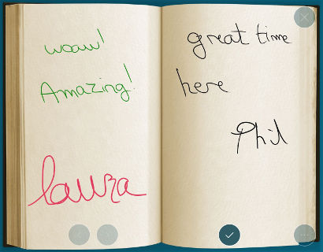
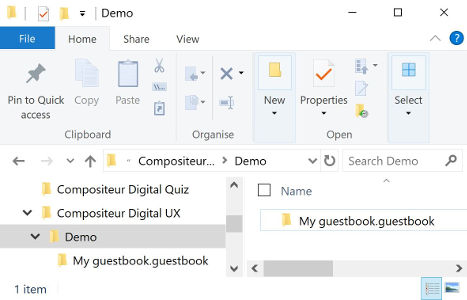

# Livre d'or

## Résumé
* [Description](#description)
* [Actions dans Compositeur Digital UX](#actions-dans-compositeur-digital-ux)
* [Extension de dossier](#extension-de-dossier)
* [Créer un livre d'or](#créer-un-livre-dor)
* [Télécharger un exemple](#télécharger-un-exemple)

## Description

Ce type de contenu vous permet de créer un livre d'or qui peut être utile pour recueillir les réactions de vos utilisateurs.

## Actions dans Compositeur Digital UX

Les éléments du livre d'or prennent en charge les actions suivantes. Pour avoir un aperçu complet de chaque action, [voir la section Actions](actions.md)

**Menu des actions**

| Capturer  | Dupliquer | Ouvrir dans l'app native | Enregistrer sous | Sélection | Partager  |
|:---------:|:---------:|:------------------------:|:----------------:|:---------:|:---------:|
| &#x2716;  | &#x2716;  | &#x2714;                 | &#x2714;         | &#x2714;  | &#x2714;  |

**Interaction avec le contenu**
| Annoter  | Consultation des pages | Enregistrer une page | Supprimer une page |
|:--------:|:----------------------:|:--------------------:|:------------------:|
| &#x2714; | &#x2714;               | &#x2714;             | &#x2714;           |

> Note : Une page peut être supprimée en appuyant sur le coin supérieur droit de la page pendant 5 secondes.

## Extension de dossier

Pour utiliser un livre d'or, ajoutez l'extension `.guestbook` à la fin du nom de votre dossier.

## Créer un livre d'or

1. Dans votre dossier univers, créez un dossier nommé `<Nom de votre livre d'or>.guestbook` (par exemple `Mon livre d'or.guestbook`).
2. (Facultatif) ajoutez un arrière-plan pour votre livre d'or dans ce dossier (nommé `_background.jpg` ou `_background.png`).
3. (Facultatif) ajoutez une vignette pour votre livre d'or dans ce dossier (nommé `_preview.jpg` ou `_preview.png`). La prévisualisation par défaut est affichée ci-dessous.

## Télécharger un exemple

Un univers de démonstration qui contient un exemple de livre d'or est disponible, [essayez-le!](../../../en/organise_content/Demo-Universe.zip) &#x1f604;

Suivant : [Panorama : vue à 360° (format Compositeur Digital UX)](panorama.md)

[Retour aux Contenus pris en charge](index.md)
