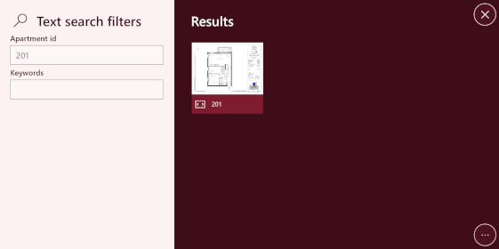
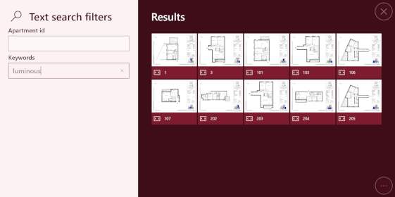

# Interface de recherche

## Résumé
* [Description](#description)
* [Actions dans Compositeur Digital UX](#actions-dans-compositeur-digital-ux)
* [Extension de dossier](#extension-de-dossier)  
  * [Extension`.filters`](#extension-filters)
  * [extension `.search`](#extension-search)
  * [Extension `.apartments`](#extension-apartments)
* [Tableur : \_list.csv ou \_catalog.csv](#tableur--_listcsv-ou-_catalogcsv)
* [Créer une interface de recherche](#créer-une-interface-de-recherche)
* [Métadonnées disponibles](#métadonnées-disponibles)
* [Téléchargez un exemple](#télécharger-un-exemple)

## Description 

Ce type de contenu vous permet d'afficher une interface de recherche pour tout élément (par exemple, appartements, plans, voitures, etc.) qui est placé dans le même dossier.

Les interfaces de recherche peuvent également inclure des zones de texte qui permettront à l'utilisateur de trouver des éléments en fonction de leur nom ou de leurs mots clés.

## Actions dans Compositeur Digital UX

Les interfaces de recherche prennent en charge les actions suivantes. Pour avoir un aperçu complet de chaque action, [voir la section Actions](actions.md).

**Menu des actions**

| Capturer  | Dupliquer | Ouvrir dans l'app native | Enregistrer sous | Sélection | Partager |
|:---------:|:---------:|:------------------------:|:----------------:|:---------:|:--------:|
| &#x2716;  | &#x2714;  | &#x2716;                 | &#x2716;         | &#x2714;  | &#x2716; |

**Interaction avec le contenu**

| Filtres  | Ouvrir un document |
|:--------:|:------------------:|
| &#x2714; | &#x2714;           | 

## Extension de dossier

Pour utiliser une interface de recherche, mettez tous les éléments dont vous avez besoin dans un dossier, et ajoutez l'extension `.filters` ou `.search` ou `.apartments` (pour les besoins immobiliers) à la fin du nom de votre dossier.

À l'intérieur de votre dossier, fournissez un fichier nommé `_list.csv` ou `_catalog.csv`. Il n'y a pas de différences entre ces fichiers, mais seuls ces noms sont pris en charge par Compositeur Digital UX.

### Extension `.filters`

L'extension `.filters` fournit une interface de recherche dynamique. Chaque fois que l'utilisateur modifie un filtre, les résultats affichés sur le côté droit de la vue sont automatiquement mis à jour pour correspondre à la sélection actuelle.

La conception d'un élément de résultat correspond à une vignette de l'élément, et à son nom.

### Extension `.search` 

L'extension `.search` est utile pour afficher une interface de recherche qui n'est pas dynamique. L'utilisateur sélectionne tous les filtres qu'il souhaite appliquer, puis appuie sur un bouton intitulé "Recherche". Les résultats de la recherche sont calculés et les éléments correspondant aux critères sont affichés.

Si l'utilisateur appuie sur la flèche de retour située dans le coin supérieur gauche de l'écran, les filtres peuvent être modifiés.

La conception d'un élément de résultat correspond à une vignette de l'élément, et à son nom.

### Extension `.apartments` 

L'extension `.apartments` utilise la même interface que l'extension `.search`. La seule différence est l'apparence du résultat.

La conception d'un élément de résultat indique diverses informations sur l'élément : surface, orientation, type, sol, etc...

 

## Tableur : \_list.csv ou \_catalog.csv

Ce fichier contient l'ensemble des données qui seront utilisées pour les critères de recherche. Ce document est un fichier `.csv`, utilisant `;` comme délimiteurs. Il peut être édité en utilisant Microsoft Excel. 

**Format**

La première ligne de la feuille de calcul représente le *type de critères*. Sélectionnez l'un des critères suivants :

| Clés          | Description                |
|:--------------|:------------------------------------------------------------------------------------------------------|
| `id`          | ** OBLIGATOIRE**. Cette colonne doit correspondre à un nom de document dans le dossier. Elle ne sera pas affichée comme critère mais sera utilisée pour ouvrir un résultat.                                                                     |
| `double`      | Critères d'affichage d'un nombre décimal.                                                             |
| `float`       | Critères d'affichage d'un nombre décimal.                                                             |
| `int`         | Critères de sélection d'un nombre entier.                                                             |
| `itemName`    | Colonne blanche. Crée une zone de texte où l'utilisateur peut filtrer les éléments en fonction de leur nom. |
| `multiple`    | Critères de sélection multiple.                                                                       |
| `price`       | Représente un prix. Ne pas préciser l'unité.                                                          |
| `single`      | Critères pour le choix unique.                                                                        |
| `surface`     | Représente une surface. Tapez "m²". Ne précisez pas l'unité.                                          |
| `text`        | rempli de mots-clés associés à chaque ligne. Crée une zone de texte où l'utilisateur peut filtrer les éléments en fonction des mots clés qui leur sont associés. Les mots-clés sont séparés par ' \| ' dans le fichier " .csv ". |
| `floor`       | Niveau du sol (cas d'utilisation d'un bien immobilier).                                               |
| `orientation` | Critères de sélection d'une orientation (par exemple "Nord", "Sud"... cas d'utilisation de biens immobiliers). |
| `state`       | Critères de sélection d'un état (cas d'utilisation de biens immobiliers).                             |
| `type`        | Nombre de pièces (cas d'utilisation d'un bien immobilier).                                            |
| `visual`      | Critères de sélection d'un visuel (cas d'utilisation d'un bien immobilier).                           |

La deuxième ligne de la feuille de calcul représente le nom du critère, qui sera affiché dans l'interface de recherche.

À partir de la troisième ligne, chaque ligne représente un élément qui peut être recherché à l'aide de l'interface de recherche.

## Créer une interface de recherche

1. Dans votre environnement, créez un dossier nommé `<Nom de votre interface de recherche>.filters` ou `<Nom de votre interface de recherche>.search` ou `<Nom de votre interface de recherche>.apartments` selon le type de vue que vous préférez (par exemple `Recherche.filters` ou `Recherche.search`).
1. Dans ce dossier, créez un fichier appelé `_list.csv` (ou `_catalog.csv`). 
1. Remplissez la feuille de calcul avec les critères que vous voulez, et décrivez votre article.
1. Pour chaque élément qui appartient à la colonne `id` de votre `_list.csv` (ou `_catalog.csv`), ajoutez un élément dans votre dossier de recherche (image, pdf, ect...)

## Métadonnées disponibles

Les métadonnées vous aideront à personnaliser le comportement de votre interface de recherche.

| Clé de métadonnées        | Type    | Par défaut | Description |
|:--------------------------|:--------|:-----------|:------------|
| `catalog.resultsMaxCount` |`nombre` | 40         | Le nombre maximum de résultats qui peuvent être visualisés dans la page de résultats. |

## Télécharger un exemple

Un univers de démonstration qui contient des exemples d'interfaces de recherche est disponible, [essayez-le!](../../../en/organise_content/Demo-Universe.zip) &#x1f604;

Suivant : [Fiche produit](productsheet.md)

[Retour aux contenus pris en charge](index.md)
