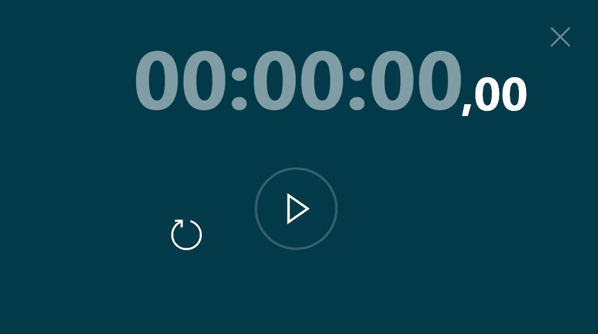
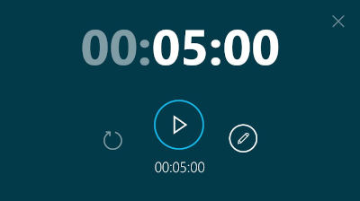
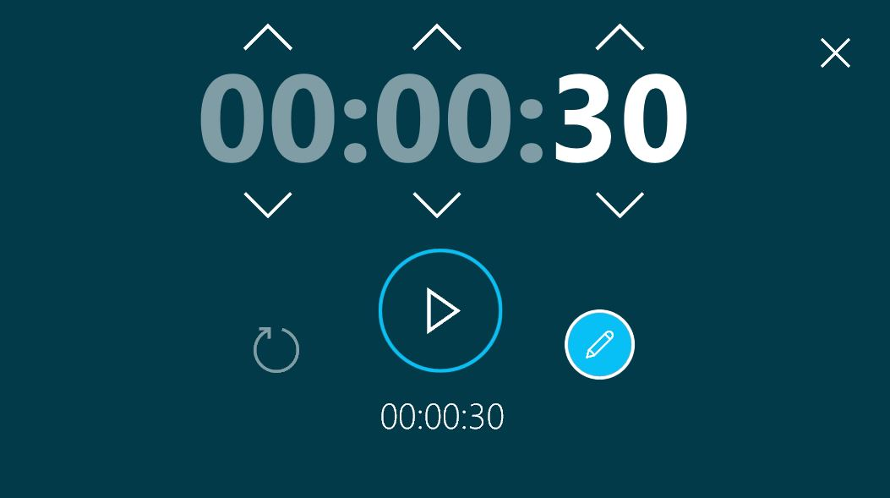
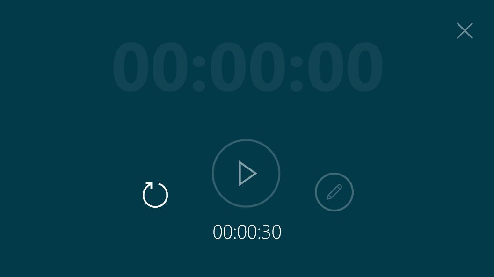
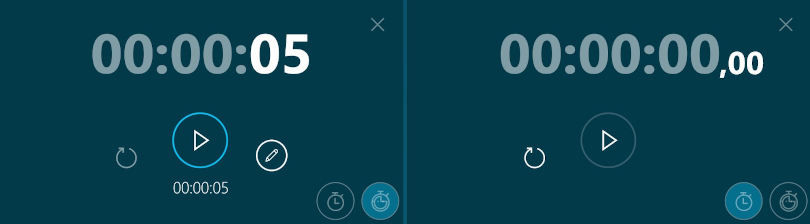

# Minuteurs

## Résumé
* [Description](#description)
* [Extension de dossier](#extension-de-dossier)
* [Créer un chronomètre](#créer-un-chronomètre)
* [Créer un minuteur](#créer-un-minuteur)
* [Créer un timer](#créer-un-timer)
* [Métadonnées disponibles](#métadonnées-disponibles)

## Description

Ce type de contenu vous permet d'afficher une minuterie. Il peut s'agir soit d'une minuterie, soit d'un chronomètre.

Voici un chronomètre :

Et voici un minuteur :

La durée du minuteur peut être modifiée en cliquant sur l'icône du stylo :

Une fois que le minuteur expire, il clignote :

## Extension de dossier

Pour utiliser un chronomètre, ajoutez l'extension `.stopwatch` ou `.chrono` à la fin du nom de votre dossier.
Pour utiliser un compte à rebours, ajoutez l'extension `.countdown` ou `.minuteur` à la fin du nom de votre dossier.
Pour utiliser un chronomètre ou un compte à rebours, ajoutez l'extension `.timer` ou `.horloge` à la fin du nom de votre dossier.

## Créer un chronomètre

1. Dans votre dossier environnement, créez un dossier nommé `<nom de votre chronomètre>.chrono` (par exemple `Mon chronomètre.chrono`).
1. (Facultatif) Vous pouvez modifier l'aperçu du chronomètre. Dans votre dossier `.chrono`, mettez une image (`.jpg` ou `.png`) nommée `_preview`. Si vous ne fournissez pas de `_preview`, l'élément aura une vignette par défaut (voir ci-dessous).

## Créer un minuteur

1. Dans votre dossier environnement, créez un dossier nommé `<(heures)h(minutes)m(secondes)s>.countdown` (par exemple `5m30s.countdown`). Il créera un minuteur initialisé pour une durée de 5 minutes et 30 secondes.
1. (Facultatif) Vous pouvez également définir la durée de votre minuteur dans un fichier `_meta.txt`. Ajoutez la valeur : 
   * `timer.duration = 5m30s` pour créer un minuteur qui doit durer 5 minutes et 30 secondes.
   * `timer.format = HH:mm` combiné avec `timer.duration = 05:30` crée également un minuteur qui doit durer 5 minutes et 30 secondes.
1. (Facultatif) Votre minuterie peut être silencieuse. Ajoutez la ligne `timer.silent = true` dans un fichier `_meta.txt`.
1. (Facultatif) La sonnerie peut être personnalisée. Ajoutez un fichier nommé `_alarm.mp3` ou `_alarm.wav` dans votre dossier `.countdown`.
1. (Optionnel) Vous pouvez changer l'aperçu du minuteur. Dans votre dossier `.timer`, mettez une image (`.jpg` ou `.png`) nommée `_preview`. Si vous ne fournissez pas de `_preview`, l'élément aura une vignette par défaut (voir ci-dessous).

## Créer un timer 

1. Dans votre dossier environnement, créez un dossier nommé `<(heures)h(minutes)m(secondes)s>.timer` (par exemple `5m30s.timer`). Il créera un compte à rebours initialisé pour une durée de 5 minutes et 30 secondes. Vous pouvez également le changer en chronomètre en cliquant sur l'icône du chronomètre.

1. (Facultatif) Vous pouvez également définir la durée de votre minuteur dans un fichier `_meta.txt`. Ajoutez la valeur : 
   * `timer.duration = 5m30s` pour créer un minuteur qui doit durer 5 minutes et 30 secondes.
   * `timer.format = HH:mm` combiné avec `timer.duration = 05:30` crée également un minuteur qui doit durer 5 minutes et 30 secondes.
1. (Facultatif) Votre minuterie peut être silencieuse. Ajoutez la ligne `timer.silent = true` dans un fichier `_meta.txt`.
1. (Facultatif) La sonnerie peut être personnalisée. Ajoutez un fichier nommé `_alarm.mp3` ou `_alarm.wav` dans votre dossier `.countdown`.
1. (Optionnel) Vous pouvez changer l'aperçu du Timer. Dans votre dossier `.timer`, mettez une image (`.jpg` ou `.png`) nommée `_preview`. Si vous ne fournissez pas de `_preview`, l'élément aura une vignette par défaut (voir ci-dessous).

## Métadonnées disponibles

| Clé de métadonnées | Type   | Par défaut | Description |
|:-------------------|:-------|:-----------|:------------|
| `timer.silent`     | `bool` | faux       | met le minuteur en mode silencieux |
| `timer.duration`   | `texte`| 0          | définit la durée de la minuterie (par exemple 1h5m30s pour 1 heure, 5 minutes et 30 secondes). Si un `timer.format` est défini, il essaie d'analyser la durée avec le format. |
| `timer.format`     | `text` | -          | définit le format à utiliser lors de l'analyse de la durée (par exemple `hhh:mm:ss`) |

Suivant : [Diaporamas (format Compositeur Digital UX)](slideshows.md)

[Retour aux Contenu pris en charge](index.md)
