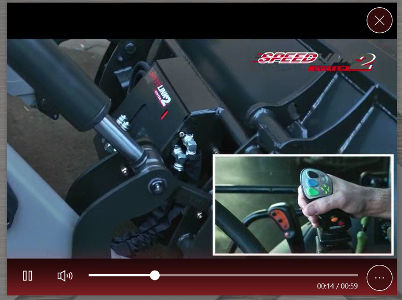

# Vidéo

## Résumé
* [Description](#description)
* [Extensions de fichiers](#extensions-de-fichiers)
* [Actions dans Compositeur Digital UX](#actions-dans-compositeur-digital-ux)
* [Codecs A/V](#codecs-av)
* [Vidéos 360°](#vidéos-360)
* [Métadonnées disponibles](#métadonnées-disponibles)

## Description

Les vidéos sont prises en charge nativement par Compositeur Digital UX.

## Extensions de fichiers 

Le Compositeur Digital UX prend en charge les fichiers `.avi`, `.flv`, `.m4v`, `.mov`, `.mp4`, `.mpeg`, `.mpg`, `.ts` et `.wmv`.

## Actions dans Compositeur Digital UX

Les vidéos prennent en charge les actions suivantes. Pour avoir un aperçu complet de chaque action, [voir la section Actions](actions.md)

**Menu des actions**

| Capturer | Dupliquer | Ouvrir dans l'app native | Enregistrer sous | Sélection | Partager | Lire en boucle |
|:--------:|:---------:|:------------------------:|:----------------:|:---------:|:--------:|:--------------:|
| &#x2714; | &#x2714;  | &#x2714;                 | &#x2714;         | &#x2714;  | &#x2714; | &#x2714;       | 

**Interaction avec le contenu**

| Annoter  | Commandes vidéo |
|:--------:|:---------------:|
|&#x2714;  | &#x2714;        | 

> Note : Une vidéo peut être annotée lorsqu'elle est en pause. L'annotation disparaît quand la vidéo est en lecture. 
> Si vous voulez garder vos annotations, pensez à faire une Capture de votre vidéo annotée.

## Codecs A/V

Un format de fichier vidéo peut intégrer différentes normes de codage/décodage. Ces normes appelées "codecs" doivent être installées sur votre ordinateur. Le [K-Lite Codec Pack](https://codecguide.com/download_k-lite_codec_pack_standard.htm) comprend une grande variété de codecs. Veuillez noter que certains codecs peu courants peuvent ne pas être pris en charge par Compositeur Digital UX.

Nous vous recommandons d'utiliser les formats `WMV` et `MP4(H264)` pour une utilisation sûre.

## Vidéos 360°

Les vidéos 360° peuvent être visionnées avec un player qui permet à l'utilisateur de changer la position de la caméra. Voir la [section Panorama](panorama.md#vidéo-projection).

## Métadonnées disponibles

| Clé de métadonnées             | Type      | Par défaut | Description                                                     |
|:------------------------------:|:---------:|:----------:|:---------------------------------------------------------------:|
| `video.autoplay`               | `booléen` | vrai       | démarre la lecture de la vidéo sur l'écran                      |
| `video.autoplay.delay`         | `nombre ` | 0          | retarde la lecture automatique du nombre de secondes spécifié   |
| `video.autoclose`              | `booléen` | faux       | ferme la vidéo lorsque la lecture arrive à son terme            |
| `video.autoclose.delay`        | `nombre ` | 0          | retarde la fermeture automatique du nombre de secondes spécifié |
| `video.rewind`                 | `booléen` | faux       | revient à la première image lorsque la vidéo se termine         |
| `video.loop`                   | `booléen` | faux       | force la lecture en boucle de la vidéo                          |
| `video.mute`                   | `booléen` | faux       | force la vidéo à être muette                                    |
| `video.controls.alwaysvisible` | `booléen` | faux       | force l'affichage permanent des commandes du player vidéo       |
| `video.controls.hide`          | `booléen` | faux       | cache les contrôles de lecture vidéo en permanence              |

[Accéder aux métadonnées communes](../advanced_setting.md#résumé)

Suivant : [Fichiers audio](audio.md)

[Retour aux Contenus pris en charge](index.md)
