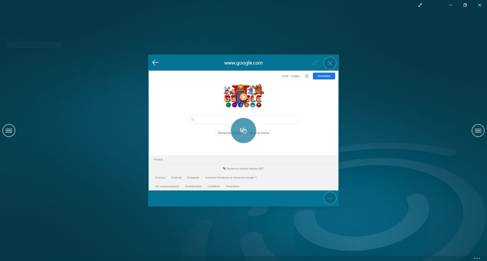

## Vérifier un lien `.cdurl` dans le Compositeur Digital UX

### Prérequis

Votre PC doit être équipé de Windows 10 et vous devez avoir le logiciel *Compositeur Digital UX* d'installé sur votre poste. Reportez-vous [à cette rubrique](https://doc.compositeurdigital.com/UX/fr/gettingstarted/) pour voir comment l'installer.

### Ouvrir le lien

En utilisant l'explorateur de fichier, faîtes un double-click sur votre fichier `.cdurl`. Le *Compositeur Digital UX* se lance, et ouvre une session dans laquelle votre lien s'affiche. 

Pour interagir avec la vue web, cliquez sur l'icône de la main. Vous pouvez ensuite interagir avec la page web. Si votre PC dispose d'un écran tactile, vérifiez que la page réagit bien lorsque vous touchez le contenu. 

Certains sites n'offrent pas un support complet des interactions tactiles, cela peut dégrader l'expérience que vous retrouvez dans le *Compositeur Digital UX*.

