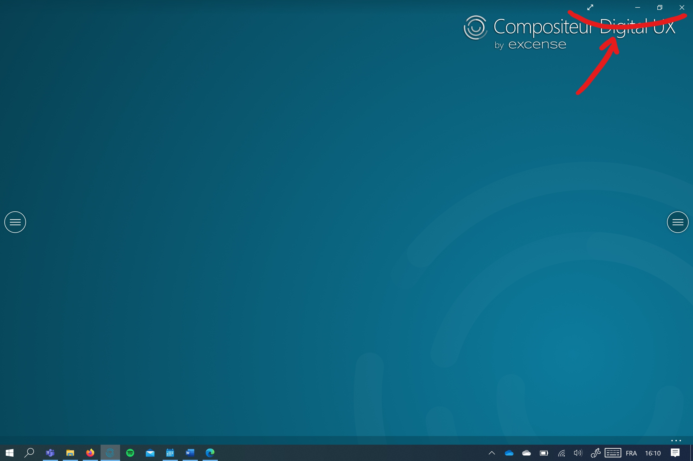
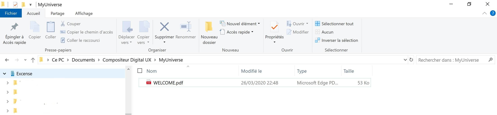
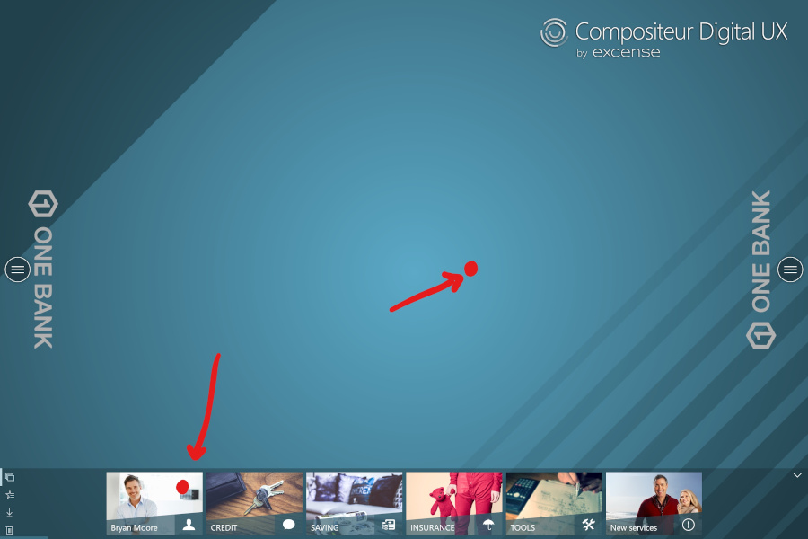

## WELCOME !
In this page will learn how to create your first presentation universe in 3 simple steps.

**It’s super easy !**

To create this presentation universe you will simply need to use your File Explorer to create folders on your computer and drag and drop documents. This tutorial will also show you how to customize your universe

**Let’s get started !**

## Prepare your environment

1. Go to your Compositeur Digital UX application and switch to your application to Windowed mode. To do that simply drag your mouse to the top left corner and click on the square button as shown below

2. Your environment should now look like this:

3. Open the file location for your presentation universe : `Documents>Compositeur Digital UX>My Universe`

## Step 1 – Add file

In this step, you will be guided to drag and drop a sample document in your universe. 

**Description** 
1.	Download this [Sample Document](samples/DocumentPDF.pdf) 
2.	Using your file explorer, place it here `Documents >Compositeur Digital UX > MyUniverse`
3.  Go to your Compositeur Digital app and refresh your universe by pressing these keys : CTRL + R + R 

**Comments:** You can use your own documents in this step. See the list of supported documents [here](http://doc.compositeurdigital.com/UX/en/organise_content/supported_content/) 

## Step 2 – Create a folder

In this step, you will be guided to create folders to organize your documents 

**Description** 
1.	Using your file explorer go to `Documents >Compositeur Digital UX > MyUniverse` and create a new folder named `My Folder`
2.	Go to your Compositeur Digital application and refresh your universe by pressing these keys : CTRL + R + R 

**Comments:** You can now add documents using step #1 or create more folder. Don’t forget to refresh ! 

## Step 3 :  Customize your universe

In this step, you will be guided to customize the background and the document previews of your universe as shown below

**Description for backgrounds** 

1.	Download this [background sample image] (samples/\_background.png)
2.	Using your file explorer, paste it here `Documents >Compositeur Digital UX > MyUniverse`
3.	Go to your Compositeur Digital application and refresh your universe by pressing these keys : CTRL + R + R 

**Comments:**  The Compositeur Digital will use any image named “_background” placed in this location as a background for your universe. See the complete documentation for backgrounds [here](http://doc.compositeurdigital.com/UX/en/organise_content/create_universes.html#background)

**Description for previews** 

To quickly customize your documents previews:

1.	Download this [preview sample image] (samples/\_preview.jpg)
2.	Using your file explorer, paste it here : `Documents>Compositeur Digital UX > MyUniverse > Myfolder`
3.	Go to your Compositeur Digital application and refresh your universe by pressing these keys : CTRL + R + R 

**Comments:** The Compositeur Digital will use any image named “_preview” placed in this location as a preview for this folder. See the complete documentation for previews [here](http://doc.compositeurdigital.com/UX/en/organise_content/create_universes.html#thumbnails)

## You can do a lot more ! ## 

You have now successfully completed the fundamental steps to create a presentation universe. You can visit our complete documentation [here] (http://doc.compositeurdigital.com/UX/en/organise_content/create_universes.html)

Send us an email at <mailto:> To learn more on uses cases for corporate presentations, collaboration and training.
