# Flux de travail

Cette section met en évidence les actions que vous pouvez réaliser en situation de réunion en utilisant le Compositeur Digital UX.

## Résumé
* [Début de votre réunion](#début-de-votre-réunion)
* [Pendant votre réunion](#pendant-votre-réunion)
  * [Ouvrir votre document](#ouvrir-votre-document)
  * [Annoter votre document](#annoter-votre-document)
  * [Utiliser des feuilles blanches et des notes](#utiliser-des-feuilles-blanches-et-des-notes)
  * [Utiliser des modèles](#utiliser-des-modèles)
  * [Structurer votre espace de travail avec un tableau en liège](#structurer-votre-espace-de-travail-avec-un-tableau-en-liège)
  * [Créer une copie de votre document](#créer-une-copie-de-votre-document)
  * [Importer un document](#importer-un-document)
    * [Depuis votre PC](#depuis-votre-pc)
    * [Coller une image](#coller-une-image)
  * [Faire votre sélection](#faire-votre-sélection)
    * [Ajouter un document](#ajouter-un-document)
    * [Vérifier votre sélection actuelle](#vérifier-votre-sélection-actuelle)
    * [Supprimer des documents](#supprimer-des-documents)
      * [Utilisation du menu d'action de l'élément](#utilisation-du-menu-daction-de-lélément)
      * [Utilisation des gestes de balayage (swipe)](#utilisation-des-gestes-de-balayage-swipe)
  * [Vérifier votre historique pour récupérer des documents](#vérifier-votre-historique-pour-récupérer-des-documents)
* [Fin de votre réunion](#fin-de-votre-réunion)
  * [Partager votre travail](#partager-votre-travail)
  * [Fermer le projet](#fermer-le-projet)

## Début de votre réunion

Votre compositeur Digital UX est lancé, en attendant l'ouverture d'un [univers](presentation.md#universes). 
Trois situations sont disponibles ici : 
1. Soit vous avez déjà créé un univers qui contient tous vos documents importants qui vous seront utiles lors de votre réunion et vous n'avez jamais travaillé sur cet univers ;
1. Vous avez un univers, et vous avez déjà sauvegardé des [projets](presentation.md#projects) ;
1. Ou vous avez simplement besoin d'un espace vide pour commencer à parler de vos objectifs de réunion.

En fonction de votre situation, ouvrez votre univers, votre projet ou commencez un espace de travail vide.

Votre réunion peut commencer dès maintenant !

## Pendant votre réunion

Au cours de votre présentation, vous serez confronté à certaines situations où vous devrez interagir avec l'espace de travail. Cette section résume toutes les actions que vous pouvez faire.

### Ouvrir votre document

Au cours de votre présentation, vous devrez probablement travailler sur des documents. Si votre univers comprend des documents, vous pouvez [ouvrir un document](presentation.md#ouvrir-un-document) en utilisant la zone de dock :

1. Si le dock n'est pas visible, appuyez sur la barre de navigation en bas de l'écran. 
1. Si votre document est déjà à l'écran, il arrivera sous votre doigt.

Si votre dock est vide, assurez-vous que le dock affiche vos documents de l'univers :

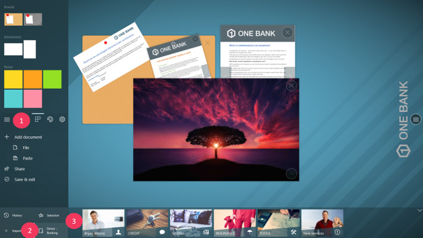

1. Appuyez sur le bouton du menu principal.
1. Appuyez sur le bouton qui contient le nom de votre univers.
1. Tous les documents qui appartiennent à votre univers sont maintenant affichés dans le dock.

### Annoter votre document

L'espace de travail vous permet d'annoter un document, il nécessite d'avoir un crayon reconnu par votre appareil. Il suffit d'utiliser le crayon de votre document. Vous pouvez changer la couleur de l'encre, ainsi que le type d'encre.

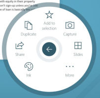 

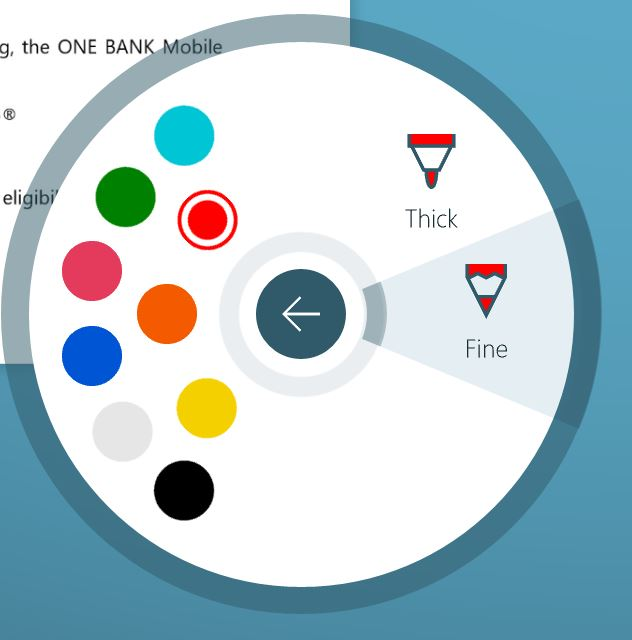

1. Appuyez sur le bouton d'action de votre document.
1. Appuyez sur 'Encre'.
1. Sélectionnez la couleur et le type d'encre que vous souhaitez.

> Note : Votre crayon doit être équipé d'une "gomme" que vous pouvez utiliser pour effacer les traits d'encre que vous avez écrits.

### Utiliser des feuilles blanches et des notes

Avez-vous besoin de papiers vides pour concevoir ? Pas de problème, nous avons ça pour vous !

Le Compositeur Digital UX vous permet de travailler avec des documents vierges et des notes pour stimuler votre processus de création d'idées.
Pour ajouter l'un de ces documents à votre projet :

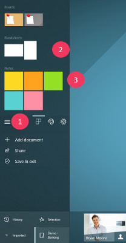

1. Appuyez sur le bouton de menu principal.
1. Parcourez la zone des documents pour sélectionner le type de document que vous souhaitez ajouter.
1. Faites glisser et déposez le document dans l'espace de travail, ou appuyez simplement sur celui-ci.

Les notes peuvent être collées sur n'importe quel document, tout comme un post-it dans la vie réelle !

Les feuilles blanches peuvent également être collées sur les documents, à l'aide du ruban.

### Utiliser des modèles 

Les modèles peuvent être très utiles, en fonction du type de réunion (liste de choses à faire, modèles, etc.). Le Compositeur Digital UX prend en charge [l'édition et la création de modèles](../organise_content/supported_content/templates.md)

Pour ajouter un modèle à votre espace de travail :

1. Appuyez sur le menu du bouton principal.
1. Parcourez la zone des documents pour sélectionner le modèle que vous souhaitez ajouter.
1. Faites glisser et déposez le modèle dans l'espace de travail, ou appuyez simplement dessus.

### Structurer votre espace de travail avec un tableau en liège

Un tableau en liège est très utile pour structurer votre espace de travail. Les documents attachés au tableau en liège ne peuvent être manipulés tant qu'ils ne sont pas détachés du tableau en liège. Vous êtes libre de manipuler le tableau en liège. Pour le déplacer, le redimensionner, etc.

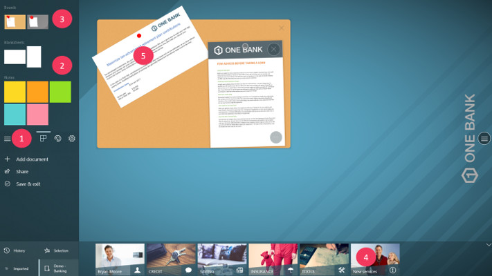

Pour ajouter un tableau en liège à votre espace de travail :
1. Appuyez sur le menu du bouton principal.
1. Parcourez la zone des documents pour sélectionner un type de tableau en liège.
1. Faites glisser et déposez le tableau en liège dans l'espace de travail, ou appuyez simplement dessus.
1. Faites glisser et déposez un document que vous voulez épingler sur votre tableau en liège.
1. Épinglez votre document.

### Créer une copie de votre document

À un moment donné, vous aurez peut-être besoin de comparer plusieurs versions du même fichier. Pour ce faire, il vous suffit de faire une copie de votre document en utilisant l'action 'Dupliquer'.
En utilisant votre crayon, vous pouvez [annoter votre document](#annoter-votre-document) et écrire le numéro de version (par exemple "V1", "V2", etc...).

> Note : Lorsque votre document est dupliqué, toutes les annotations et les documents qui y sont collés sont également dupliqués.

### Créer une capture de votre document

Vous pouvez créer une capture d'un document pour y ajouter des annotations. Par exemple, les vidéos ne prennent pas en charge les annotations. Si vous souhaitez modifier une image de la vidéo, vous pouvez faire une capture de l'image. 
Utilisez le menu d'action de votre élément, et appuyez sur 'Capture'.

### Importer un document

Au cours de votre réunion, vous devrez peut-être ajouter des documents qui ne font pas partie de vos univers. Pour ce faire, vous disposez de deux moyens différents :

#### Depuis votre PC

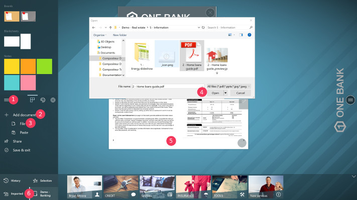

1. Appuyez sur le bouton du menu principal.
1. Appuyez sur 'Ajouter un document'.
1. Appuyez sur 'Fichier'.
1. À l'aide du sélecteur de fichiers, sélectionnez le document que vous souhaitez ajouter.
1. Votre document fait maintenant partie de votre projet.
1. Vous pouvez le récupérer dans les documents 'Importés'.

#### Coller une image

Vous pouvez importer des images provenant de l'extérieur du Compositeur Digital UX. Il suffit de copier une image dans votre presse-papiers (clic droit, copier).

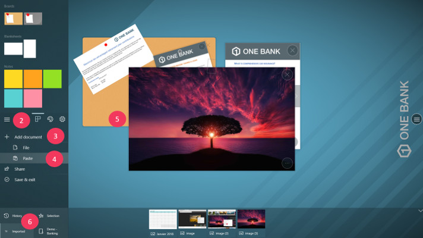

1. Copiez une image dans votre presse-papiers. 
1. Appuyez sur le bouton du menu principal.
1. Appuyez sur 'Ajouter un document'.
1. Appuyez sur 'Coller'.
1. L'image fait maintenant partie de votre projet.
1. Vous pouvez la récupérer dans les documents 'Importés'.

### Faire votre sélection

Lorsque vous avez appliqué des modifications importantes à un document spécifique, ou si le document lui-même est très important, vous pouvez l'ajouter à votre sélection. La sélection vous permet d'enregistrer tous les documents qui sont importants pour les objectifs de votre projet et de les partager facilement.

#### Ajouter un document

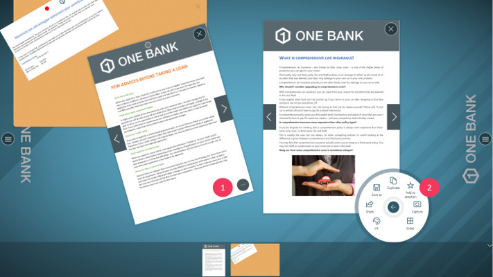

Pour ajouter un élément à votre sélection :
1. Appuyez sur le bouton d'action de l'élément (l'élément doit se trouver dans l'espace de travail).
1. 1. Appuyez sur 'Ajouter à la sélection'.

#### Vérifier votre sélection actuelle

Tous les objets appartenant à votre sélection peuvent être récupérés dans la zone de dock.

[Sélection](../../en/img/workflow_selection.jpg)

1. Appuyez sur le menu du bouton principal.
1. Appuyez sur "Sélection" en bas du menu.

Votre sélection apparaît sur le dock.

#### Supprimer des documents

Pour retirer un document de la sélection, vous avez deux possibilités.

##### Utilisation du menu d'action de l'élément

Flux de travail supprimer l'élément de la sélection](../../en/img/workflow_delete_selection_item.jpg)

1. (Facultatif si l'élément se trouve déjà dans l'espace de travail) Appuyez sur l'élément dans la sélection pour l'ouvrir. 
1. 1. Appuyez sur le bouton d'action de l'élément (en bas à droite).
1. 1. Appuyez sur 'Retirer de la sélection'.

##### Utilisation des gestes de balayage (swipe)

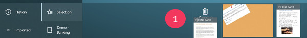

1. Effectuez un balayage sur l'élément, de haut en bas. L'élément sera retiré.

### Vérifier votre historique pour récupérer des documents

Si vous avez retiré un document de l'espace de travail, gardez à l'esprit que ce document n'est pas perdu ! Il peut être récupéré dans votre historique.

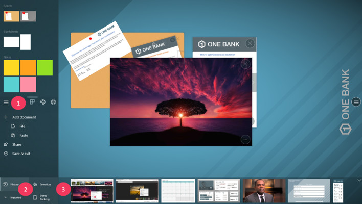

1. Appuyez sur le bouton du menu principal.
1. Appuyez sur 'Historique' en bas du menu.
1. L'historique est maintenant accessible depuis le dock.

> Note : vous pouvez supprimer définitivement un document de l'historique. Pour ce faire :
> 
> 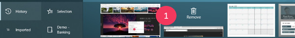
>
> 1. Effectuez un balayage sur l'élément, de haut en bas. L'élément sera retiré.

## Fin de votre réunion

Maintenant, votre réunion est terminée, et vous voulez que les personnes avec lesquelles vous avez travaillé partent avec les documents importants que vous avez manipulés ensemble.

### Partager votre travail

Vous devez partager le projet en cours avec vos collègues, ou avec votre client, différentes options vous sont proposées : 
* Vous pouvez partager un seul document.
* Vous pouvez partager votre sélection.
* Vous pouvez partager les documents qui sont ouverts à l'écran.
* Vous pouvez partager une capture d'écran de votre espace de travail.
* Vous pouvez partager une copie de votre projet. Cette copie peut être ouverte en utilisant le Compositeur Digital UX.

Vous pouvez envoyer les documents par e-mail, ou enregistrer une copie locale du document sur votre disque dur ou clé usb.

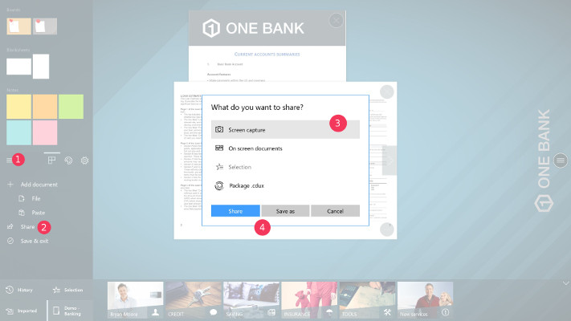

1. Appuyez sur le bouton du menu principal.
1. Appuyez sur 'Partager'.
1. Sélectionnez le document que vous souhaitez partager.
1. Sélectionnez l'endroit où vous souhaitez envoyer le document (c'est-à-dire le courrier électronique ou le disque dur).

### Fermer le projet

Vos documents ont été partagés, vous pouvez quitter l'espace de travail. Si vous travaillez sur un univers pour la toute première fois, un message vous demandera si vous voulez sauvegarder votre travail. Ensuite, vous retournerez à la page [Univers] (presentation.md#universes)

Pour quitter un projet :
1. Appuyez sur le bouton du menu principal.
1. Appuyez sur 'Enregistrer et quitter'.
1. (Facultatif) Si vous travaillez sur un projet pour la toute première fois, une invite vous demandera si vous souhaitez enregistrer votre travail. Si ce n'est pas le cas, le projet sera enregistré automatiquement.

[Suivant : Cas d'utilisation : Recommandations](use_cases.md)

[Retour au Guide de l'utilisateur](index.md)
