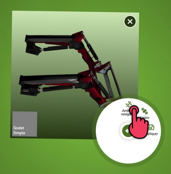
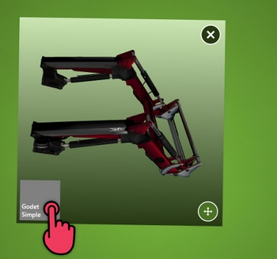

# 3D object

Use this content type to obtain a real-time rendering of a 3D model .

## Interactions in the Compositeur Digital

On a 3D model you can:

- Press the central button to activate the rotation  

- Orbit around the model by sliding your finger on various directions
- Shrink and zoom using two fingers
- Deactivate the rotation using a dedicated button on the bottom right (next to the document menu) 

## Content management

- Supported file extensions : `obj`, `3ds`, `lwo`, `stl`, `u3d`, `pdf`*

### Multiple file systems

Some 3D files may require additionnal files for textures or other features. In this case, place the all the required files in a single folder using the following extension:

In this example you can see a `3ds` file along with its corresponding texture files in a folder named `Front Loader 3D.3ds`.

>#### * 3D Pdf files
>3D models can be embedded in a PDF file. If you need to use such a PDF file in the Compositeur Digital, place it in a folder with the extension `.u3d`. e.g. `Front Loader.u3d/model.pdf`.

### Displaying multiple parts of a model

You can choose to show or hide parts of a 3D model when displayed in the Compositeur Digital. To do so, split the model in as many parts as desired, create a file for each part and place those files in the same folder.

A dedicated button will let you focus the view on a selected part of the model and a checkbox will let you toggle between hide and view.

 

### Performance

The rendering performance depends on both the complexity of the model and your device performance. Try to keep your 3D models as simple as possible in terms of number of triangles (polygons). To display a 360° view of a model please refer to section [360° objects](sequence.md). For panoramic views, see [3D panoramas](sequence.md).

[Back to supported types](content_types.md)
