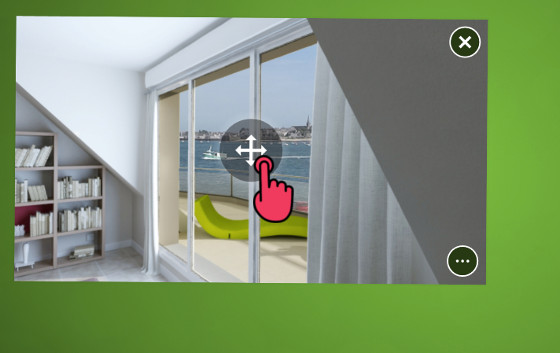
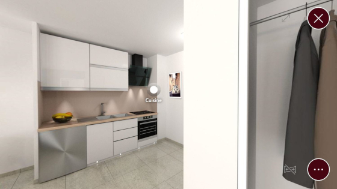
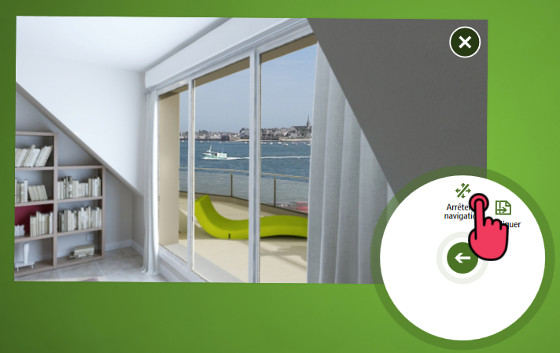

# 3D panorama

Use this type of content to display a 360° view of a scene such as landscapes or interior views. 
This content also supports virtual tours (krpano), which allows the user to explore a virtual space by navigating between scenes. 

## Interaction in the Compositeur Digital

On a 3D panorama you can:

- Press the central button to activate the panoramic view 

- Slide your finger to look at different directions
- Shrink and zoom-in using two fingers
- Navigate between various scenes using hotspots available in each scene

- Deactivate the panoramic view using the dedicated button at the bottom right (next to the document menu) 

## Content management

- Folder extension: `panorama`
- Supported extensions in the folder: `jpg`, `png`, `wmv`, `mp4`, `avi`, `mpg`, `mov`, `mpeg`, `ts`, `flv`.

### Tour (Krpano)

If you already have virtual tours files (krpano), you can place them inside a `panorama` folder. The file defining the tour, an xml file containing all the scenes and all the hotspots, should be placed at the root of the folder, and named `_tour.xml`. All the graphical resources used for the tour should also be placed in the `panorama` folder, and their path should respect the `url` defined inside the `_tour.xml` file. 

If your `_tour.xml` file contains `<include>` tags, to include various files defining your tour, these files should be included at the root of the `panorama` folder.

You can customize the look of the hotspot by providing an image file which has to be named `_hotspot.png`.

### Spherical projection

Place a single image or video with the spherical projection of the scene in the folder.

### Cubic projection

Place the 6 images corresponding to the cubic projection of the scene in the folder. 

By default the field of vision is set to 110°. You may change this value with the meta `panorama.FieldOfView`. See [Advanced configuration](config.md) for instructions on how to set meta values.
