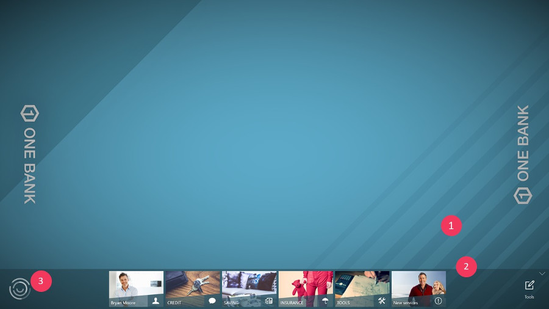
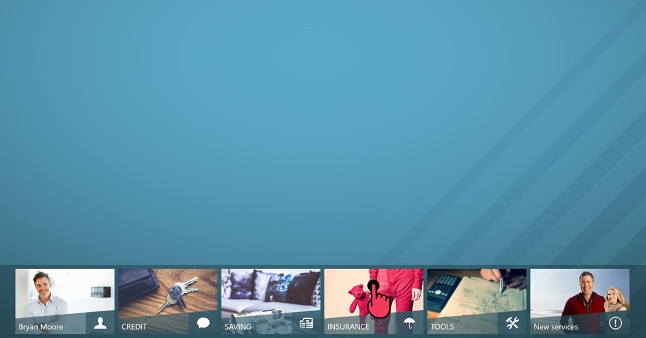
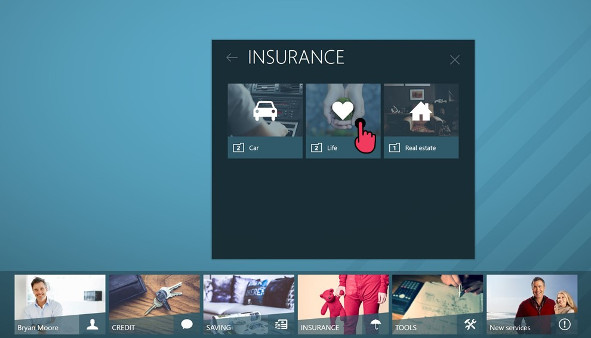
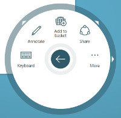
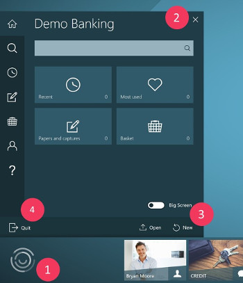
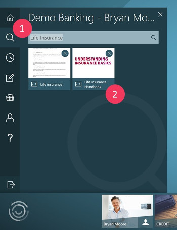
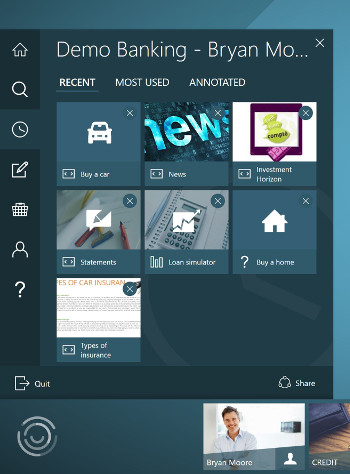
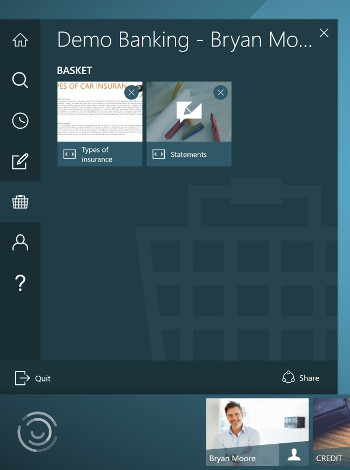
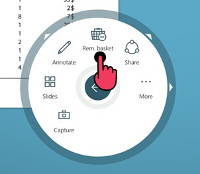
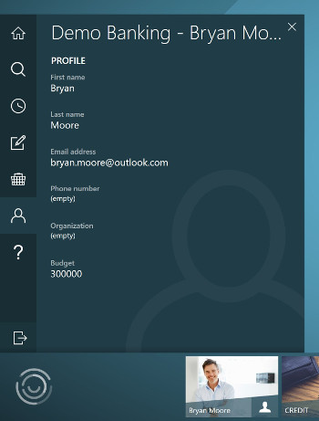

# Features overview

## Overview

The user interface contains three main areas:

1. A collaborative area to display and interact with the content.
2. A dock to browse and access your content. 
3. The main menu button  

## Opening a document

1. On the dock, tap on the folder to open it 
2. In the folder view, tap on any document to display it 

## Manipulating a document

Use the following gestures:

Move 

Resize 

Rotate 

To close a document, tap on the cross at the top right :

 Additionnal actions (annotate, print, share, *etc.*) are available in the `document action menu`  at the bottom right of content:

## Creating projects

All your interactions with the document in an environnement are automaticaly saved (opened documents, annotations, user data). You can  assign a name to save the current projet to access it later.

1. Open the main menu.
2. Enter a project name on the top of the panel.  

3. The `Open` and `New` buttons allows you to load a previously saved project or create a new project from the current environment.
4. The `Quit` button will close the current environment to take you to back the home page of the application

## Search feature

1. In the main menu, type in your keywords in the search text box.
2. Documents with file names matching your criteria will appear as you type. Tap on the document view to open it.

## Recent and frequetly used documents

This tab gives allows you to quickly access to all the documents that were opened at least once in the current environment. You can either sort them by most recent use with the `Recent` filter, or by number of use by tapping the `Most frequently used` filter.

## Notes and blank sheets

This tab lets you recall all sticky notes and blank sheets that were created in the current environment 

## Basket

The basket feature allows you to gather documents to be shared all at one. (folder file)  
The `share` button will let you share the basket over a usb key or via e-mail. The basket can also be stored locally for further use. 

To add a document to the basket simply tap the `Add to basket` button located in the document menu.

To remove a document from the basket, tap the `Rem. basket` button in the same menu. You can also remove the document from basket view located in the Main menu by hitting the close button on the top right of the document icon view. 

## Profile

The Profile tab displays the default data relating to your customer. These data will can be used as default values for actions triggred within the application.  e.g. the `e-mail` field, will be used as the recipient address when sharing a document over e-mail, and the `budget` information will be used by the [mortgage simulator](bank_simulator.md).

## Information

This last tab displays general information on the software.
You will also find in this section a shortcut to this documentation and an application rating bar to share your feedback
Use the `Support` button to send a email our support if you need assistance or to report a bug.

You can now move to [Content management](manage_contents.md).
